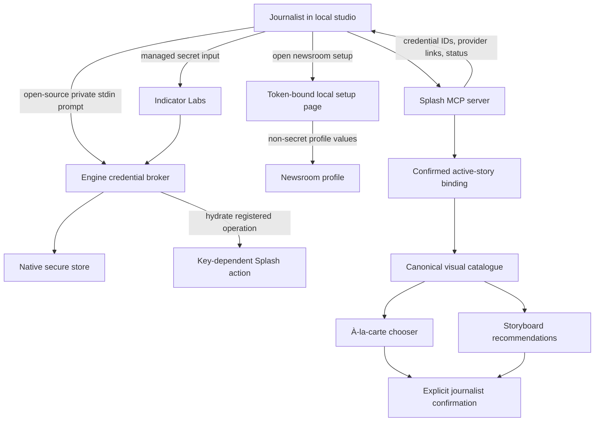
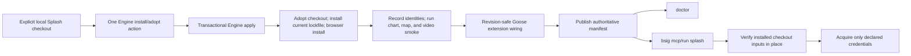
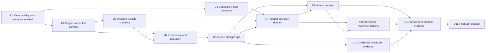

# Splash interactive preflight and visual selection PRD

**Current surface (2026-08-26):** the Goose MCP App view described below is
retired. The journalist-facing UI is a loopback studio in the OS browser. Stdio
MCP remains as a portable opener (`open_splash`); confirmation, setup, and
selection stay on the local page.

**Credential-input amendment (2026-09-01):** Splash's studio and setup page
report credential IDs, provider links, and broker status only. Indicator Labs
owns credential input for managed installations. Open-source users configure
the same IDs through Engine's protected `bsig` stdin/keychain flow outside
Splash, with values entered through a private prompt rather than agent chat.
This amendment supersedes older local credential-input, mutation, and migration
requirements retained below as implementation history.

## Summary

Splash gives journalists a graphical path from preflight to a confirmed visual choice. The local
studio reports readiness, explains unavailable capabilities, collects non-sensitive choices, and
presents the same visual catalogue in two modes: an expert-oriented à-la-carte chooser and an
AI-recommended storyboard chooser. It shows every credential's exact Engine ID, status, purpose, and
provider link but never accepts a value.

The separate local setup page collects the newsroom's non-sensitive identity, colours, typography,
language, and credit convention while repeating credential status and safe setup guidance. Managed
users save credentials in Indicator Labs. Open-source users configure them through Engine's
protected `bsig` stdin/keychain flow outside Splash. Existing `.env` values are reported by ID for
manual migration; neither Splash page reads or moves those values.

During development, Splash will use the same Engine control plane as Spotlight and Mycroft: one
install/adopt action, one manifest, doctor, launch, repair, and uninstall. That action adopts the
current local Splash checkout, installs its root dependency tree and one compatible browser, wires
Goose when present, and verifies the result in place. Normal MCP and operation launches do not
reinstall packages or copy the checkout into per-run scratch space.

Immutable source refs, a signed Splash catalogue entry, standalone Engine bootstrap, and public
release/update/rollback pinning are deliberately deferred while Splash is still changing quickly.
The development manifest records a stable source mode, paths, data ownership, and runtime interfaces
now, with optional release-provenance fields reserved for later. Promoting the same install contract
to a signed release must therefore require no credential, story, newsroom, Goose-configuration, or
user-command migration. A public one-click installer is a release task, not a prerequisite for
building or testing Splash today.

## Problem

Splash's current preflight accurately reports whether MapTiler, Datawrapper, and Cloudflare
capabilities are available, but its repair path assumes too much technical knowledge. The installer
does have a loopback browser form with password inputs, yet its provider locations are plain text,
its saved values land in the repository root `.env`, and the same guided interface is not available
at the moment preflight discovers a missing capability.

That creates four user-facing failures:

- A journalist may be told which environment variable is missing without receiving a direct,
  clickable path to obtain it.
- Credentials are tied to one Splash checkout and can be duplicated across story or installation
  directories.
- Moving storage into a keychain without changing execution would make existing producers unable to
  read newly saved credentials, because they currently expect process environment variables or the
  root `.env`.
- A journalist who already knows what visual they want still has to express it conversationally,
  while a journalist following storyboard recommendations has no reusable graphical choice surface.

There are also security discrepancies between Splash and the stronger local patterns already used
by Engine and Spotlight. Splash's `/verify` and `/submit` requests are separate, but `/submit` does
not repeat all provider verification. Its loopback server does not currently apply Spotlight's
per-run token and same-origin checks. These gaps must be closed as part of the interface work rather
than preserved behind a more polished page.

## Goals

- Let a non-engineer complete preflight without copying commands into a terminal or pasting a secret
  into chat.
- Give every credential a plain-language purpose, required permissions, and a clickable official
  acquisition link.
- Store credentials once through Engine's native broker on supported platforms, never primarily in
  a Splash checkout.
- Make a newly saved credential usable by the next relevant Splash operation without exposing a raw
  secret-retrieval command.
- Keep newsroom branding and other non-secret configuration visibly separate from credentials.
- Provide one canonical visual catalogue shared by à-la-carte selection and storyboard
  recommendations.
- Preserve explicit human confirmation: an AI recommendation is never a selection until the
  journalist confirms it.
- Keep capability failures non-blocking when the requested visual or delivery path does not require
  the missing credential.
- Preserve existing non-Goose Splash workflows while the new graphical experience is introduced for
  Goose.
- Use the same Engine setup, manifest, doctor, launch, repair, and uninstall control plane as
  Spotlight and Mycroft while keeping Splash's product-specific checkout, Bun dependencies, and
  browser payload explicit. Development update/rollback support is not a release gate.
- Present development setup as one install/adopt action using an already installed local Engine.
  Defer automatic Engine acquisition and the public signed installer until release hardening.
- Install every supported chart, image, map, web, scrolly, video, Datawrapper, and delivery capability
  in that one transaction; there are no separately installed or on-demand capability packs.
- Keep the removable machine checkout separate from journalist-owned stories and newsroom
  configuration so an update or uninstall cannot confuse installed files with durable work.
- Give macOS, Linux, and Microsoft users an honest, tested storage route or a clear unsupported-state
  explanation; do not infer Windows/WSL parity from native Windows code alone.

## Non-goals

- Redesigning Splash's visual doctrine, craft skills, chart geometry, map grammar, or delivery
  quality gates.
- Replacing conversational editorial judgment with an exhaustive form.
- Building equivalent embedded interfaces for Codex, Gemini, or other hosts in this release.
- Introducing Flue or `dev-browser` into Splash. Goose remains the graphical orchestration host;
  Splash uses `puppeteer-core` with Engine's separately managed exact browser and keeps Remotion as
  the video runtime. Full `puppeteer` is development-only.
- Creating a second minimized or capability-pack runtime alongside the installed Splash checkout.
- Adding a general command that returns plaintext credentials to an agent or shell.
- Silently falling back to plaintext storage when an operating-system credential service is
  unavailable.
- Claiming that the existing CMS insertion placeholder performs live publishing. The interface may
  preserve existing non-secret configuration honestly, but this release does not collect or migrate
  a CMS token. That credential enters scope only with a real closed CMS operation.
- Automatically creating provider accounts or credentials on the journalist's behalf.
- Automatically selecting, producing, or delivering every compatible visual.
- Publishing, signing, or pinning a distributable Splash release while the product is still in active
  development. The ordinary `bun.lock` remains dependency hygiene and may change with reviewed
  development updates; it is not treated as an immutable product release.

## Key decisions

- **Sensitive input is out of band.** Splash pages show credential status and official provider
  links but never accept values. Indicator Labs supplies the protected input path for managed
  installations. Open-source users use Engine's protected `bsig` stdin/keychain flow outside Splash,
  entering values through a private operating-system or terminal prompt rather than MCP arguments,
  model context, chat, command arguments, shell history, or repository files.
- **Engine owns credential storage.** Splash extends the existing Engine key inventory and storage
  contract rather than adding another JavaScript keychain abstraction. Engine remains responsible
  for macOS Keychain, Linux Secret Service, Windows Credential Manager, redaction, validation, and
  runtime hydration.
- **Engine owns one product lifecycle.** Splash uses the same reviewed plan/apply/manifest/doctor/run/
  uninstall control plane as Spotlight and Mycroft. During development it adopts an explicit local
  checkout; a setup view does not install Bun packages, browsers, Goose configuration, or runtime
  files independently.
- **Release provenance is deferred, not designed around.** The development install does not require a
  signed Splash catalogue row, immutable commit, or automatic Engine download. Its manifest records
  `source_mode: development` and the same stable runtime/data/config fields a later
  `source_mode: release` install will use. Release signing adds provenance and enforcement; it does
  not move user data or change the launch/configuration contract.
- **The installed checkout is the runtime.** Engine adopts the current checkout, installs the root
  `bun.lock` once, installs one compatible browser, and records the checkout, Bun, dependency
  receipt, browser, and fixed launch entrypoints in the product manifest. It does not build or
  maintain a second production-only runtime tree.
- **Runtime and journalist data have different lifecycles.** The configured stories root and newsroom
  file are data-bearing and remain outside the removable checkout. A new managed install records
  `newsroom_path` as `~/.config/splash/NEWSROOM.md` by default; preflight must read that manifest-owned
  path, never a newsroom file shipped in the source checkout. Updates and uninstall may replace
  installed code and dependencies but never treat stories, beats, exports, or newsroom configuration
  as installation artifacts.
- **Storage and execution ship together.** Removing `.env` as the primary store is not complete until
  every key-dependent Splash boundary can receive the required value at execution time. The design
  must not add `keys get` or hydrate unrelated processes.
- **Non-secret configuration remains inspectable.** Account identifiers, CMS kind and endpoint, and
  newsroom branding live in canonical `NEWSROOM.md` fields rather than the credential broker.
- **One catalogue, two choice modes.** À-la-carte and storyboard views render the same canonical
  catalogue and compatibility rules. Storyboard adds a ranked recommendation and rationale; it does
  not maintain a second list of visual types.
- **No implicit plaintext fallback.** A platform without an available secure store fails closed and
  explains the remedy. Any temporary legacy-file compatibility is explicit, visibly weaker, and
  never selected merely because the secure store failed.
- **Goose is the first graphical host, not a new product boundary.** The underlying catalogue,
  preflight results, story files, and human gates remain host-neutral Splash contracts.

## Actors

- **A1. Journalist:** configures the newsroom, obtains credentials from providers, chooses visuals,
  and confirms or rejects AI recommendations.
- **A2. Goose MCP host:** renders the embedded Splash views, exposes supported host capabilities, and
  may grant or deny requests to open an external browser URL.
- **A3. Splash MCP server:** reports preflight state, serves UI resources, opens the local newsroom
  setup flow, and persists non-sensitive selection state without receiving credential values.
- **A4. Local setup controller:** serves the token-bound loopback page, validates request shape,
  writes revision-checked non-secret configuration, reports Engine credential status, and refuses
  credential input or mutation.
- **A5. Engine:** owns credential metadata, secure storage, redaction, validation boundaries, and
  scoped runtime hydration.
- **A6. Provider:** issues and validates a credential, such as MapTiler, Datawrapper, or Cloudflare.

## Experience architecture



The embedded app has two top-level destinations: **Readiness** and **Choose visual**. Readiness is the
default and shows hard blockers, optional capabilities, newsroom status, and the setup action. Choose
visual is available only after the journalist has confirmed an Engine-validated active-story binding
and that story has an unresolved supported selection gate. The globally registered extension must
not infer a story from the Goose or process working directory. A model-callable request may nominate
a story path, but it performs no mutation: Engine canonicalizes it beneath the adopted Splash story
root, verifies the expected story markers, and returns a non-secret descriptor. The app shows the
exact story name and location; only an app-only confirmation challenge proved by U1 may bind that
descriptor to the current MCP session. Without that isolation, the existing textual human gate owns
binding and confirmation. An À-la-carte entry opens the bound gate without ranking, while a
Storyboard entry opens the same gate with the current recommendation and alternatives. A launch from
an active recommendation deep-links there. Back returns to Readiness. Reload on the same connection
reconstructs the destination and gate from canonical state; a new MCP process starts unbound and
requires confirmation again.

The external setup page has two persistent tabs: **Newsroom** and **Key status**. Key status lists
the exact Engine IDs, official provider links, current broker state, and the managed/open-source
setup routes without rendering credential inputs. Newsroom remains editable. Done and Close setup
refer only to completed non-secret saves. Returning to the studio restores focus to the initiating
control and refreshes status when supported, with a visible manual Refresh fallback.

## Credential and configuration inventory

| Value | Classification | Destination | Verification expectation |
| --- | --- | --- | --- |
| `MAPTILER_KEY` | Credential | Engine broker | Real MapTiler request before accepted |
| `MAPTILER_DELIVERY_KEY` | Credential intended for delivered client output | Engine broker until delivery | Stored as unverified because origin restriction prevents a truthful local probe |
| `DATAWRAPPER_TOKEN` | Credential | Engine broker | Authenticated Datawrapper account request |
| `CLOUDFLARE_API_TOKEN` | Credential | Engine broker | Token activity and selected-account access verified; Pages Edit scope remains user-attested until a real deployment or a non-mutating scope-introspection API can prove it |
| `CLOUDFLARE_ACCOUNT_ID` | Non-secret identifier | `NEWSROOM.md` | Shape-checked and paired with token verification |
| `CMS_KIND` | Non-secret configuration | `NEWSROOM.md` | Restricted to integrations Splash actually describes |
| `CMS_ENDPOINT` | Non-secret configuration | `NEWSROOM.md` | HTTP/HTTPS URL validation; no claim of live integration |
| Newsroom identity and brand fields | Non-secret editorial configuration | `NEWSROOM.md` | Parsed through the same contract preflight reads |

The credential catalogue must own, for each entry, its stable ID, display name, purpose, capability,
official acquisition URL, required permissions, sensitivity, validator status, and replacement or
removal behaviour. User interfaces must render this metadata rather than maintaining their own
hard-coded provider lists.

## Required user flows

### F1. Open preflight in Goose

- **Trigger:** The journalist starts Splash, requests preflight, or reaches a capability-dependent
  choice.
- **Actors:** A1, A2, A3.
- **Steps:** The embedded view shows hard blockers separately from optional capabilities, reports
  which credentials are saved or verified without exposing values, and offers Configure beside each
  repairable state.
- **Outcome:** The journalist can continue with available capabilities or deliberately open setup.

### F2. Configure credentials outside Splash

- **Trigger:** Preflight reports a closed credential-backed capability.
- **Actors:** A1, A3, A5, A6 and Indicator Labs for managed installations.
- **Steps:** Splash shows the exact Engine credential ID, purpose, required scope, and official
  provider acquisition link. Managed users save it in Indicator Labs. Open-source users have a
  trusted local agent prepare Engine's protected `bsig` stdin/keychain flow, then enter the value
  only through a private prompt outside chat and Splash. Splash never receives the value.
- **Outcome:** Refresh reports broker availability, stored state, validation outcome and timestamp,
  and resulting capability. Credential-independent work remains available throughout.

Credential cards use this display-state contract:

| State | Visible status | Available action |
| --- | --- | --- |
| Broker unavailable | Secure storage unavailable with the specific platform/contract reason | Follow the Engine repair guidance; provider links and newsroom editing remain available |
| Not saved | Not saved; capability consequence and exact credential ID named | Obtain the key and use Indicator Labs or the protected open-source `bsig` path |
| Saved and verified | Saved; verified dimensions and timestamp; resulting capability | Continue or replace outside Splash, then refresh |
| Saved, unverified | Saved; each unverified dimension and reason | Complete required attestations outside Splash or continue only where the capability contract permits |
| Status changed elsewhere | Refreshed broker state | Re-evaluate available capabilities; Splash performs no credential mutation |

Closing setup never affects credentials because the page cannot mutate them. Done reports only
non-sensitive newsroom saves and tells the journalist to refresh credential status after completing
either external setup path.

### F3. Configure the newsroom

- **Trigger:** The journalist opens the Newsroom tab from setup or preflight reports the profile as
  missing.
- **Actors:** A1, A3, A4.
- **Steps:** The page offers manual identity, language, colour, ground, typography, and credit fields,
  plus the existing option to derive proposals from the newsroom's own site. Derived values remain
  proposals and never overwrite a value the journalist entered. Saving compares the profile revision
  that was loaded, preserves unknown supported content, and refuses a stale overwrite.
- **Outcome:** A valid profile or an explicit decline closes the newsroom portion of preflight.

### F4. Choose à la carte

- **Trigger:** The journalist selects the new À la carte Splash option because they already know the
  desired visual.
- **Actors:** A1, A3.
- **Steps:** The view operates on one active story slot and one existing storyboard sub-gate at a
  time, after showing and confirming the Engine-validated story binding. It groups and filters the
  choices valid at that gate without bypassing intake, takeaway,
  journalist-hand, reference, palette, or brief decisions. Incompatible choices are disabled with a
  concrete reason; missing optional credentials offer setup without erasing disposable UI state.
- **Outcome:** Each explicit confirmation writes only the active canonical gate. Changing an already
  confirmed publication format explicitly reopens that gate, clears its dependent size,
  reachability, candidates, choice, `producer`, and `datawrapperType`, then resumes the normal ordered
  exchange before production.

### F5. Confirm a storyboard recommendation

- **Trigger:** Storyboard has enough evidence to propose a visual candidate.
- **Actors:** A1, A3.
- **Steps:** Splash ranks reachable candidates for the active sub-gate from the same catalogue,
  presents the recommended candidate and rationale, shows alternatives and trade-offs, and lets the
  journalist select or revise one. The view does not treat recommendation, focus, or silence as
  confirmation, and it cannot silently change a slot-level publication format while confirming a
  treatment candidate.
- **Outcome:** Only the explicit confirmation updates canonical storyboard state and permits the next
  editorial gate or producer dispatch.

### F6. Resume without losing state

- **Trigger:** Goose reloads, the MCP App closes, setup is closed, or a session resumes later.
- **Actors:** A1, A2, A3, A5.
- **Steps:** Splash reconstructs non-sensitive state from canonical files and obtains only saved/not
  saved or validation status from Engine. It never renders credential fields or exposes mutation
  actions. Newsroom and visual-selection mutations still present the revision observed by the view;
  stale state returns a conflict and asks for refresh rather than applying last-writer-wins.
- **Outcome:** The journalist resumes at the same unresolved gate without re-entering completed
  choices.

### F7. Retire a legacy `.env`

- **Trigger:** Splash detects supported credential names in the current legacy root `.env`.
- **Actors:** A1, A4, A5.
- **Steps:** The page names detected credential IDs without showing or reading values and separately
  offers named non-secret integration fields for revision-checked import into `NEWSROOM.md`.
  Credential values are moved to Engine outside Splash: through Indicator Labs for managed users or
  the protected `bsig` stdin/keychain flow for open-source users. After broker status confirms the
  matching ID is stored, the user removes the legacy assignment by hand.
- **Outcome:** Splash never chooses credential authority or deletes a secret-bearing line. Explicit
  legacy direct runs may continue reading an unmigrated `.env`; managed Engine operations use only
  broker state.

## Functional requirements

### Embedded and out-of-band interface

- R1. Splash must expose a Goose MCP App view for preflight status, newsroom entry points,
  à-la-carte selection, and storyboard candidate confirmation. Its navigation, async statuses,
  grouped choices, validation/conflict messages, and external-setup transitions must be semantic,
  keyboard- and screen-reader-operable, touch-usable, and readable without horizontal scrolling at a
  320 CSS-pixel viewport.
- R2. The MCP App must never request or transport passwords, API keys, access tokens, or payment
  credentials through tool arguments, model context, app state synchronization, or in-band form
  submission.
- R3. Every credential card must show the exact Engine ID, current status, purpose, required scope,
  and official provider link. It must explain the Indicator Labs managed path and the protected
  open-source `bsig` stdin/keychain path without rendering an input or authorizing a mutation.
- R4. The local newsroom controller must bind only to loopback on an ephemeral port, apply a per-run
  unguessable session boundary, reject cross-origin and unexpected-host requests, set no-store
  responses, enforce request-size and idle/overall timeouts, and become unusable after successful
  Done, Close setup, or expiry. Credential mutation routes fail closed without calling Engine.
- R5. Engine's external credential clients must validate and commit a candidate as one authority
  operation. Invalid, unavailable, rate-limited, or insufficiently demonstrated candidates must not
  replace the prior stored value. Splash only reads the resulting public status.
- R6. Neither success nor failure responses, logs, analytics, exception messages,
  application-visible setup URLs, generated files, nor recorded provider request URLs may contain
  submitted credential values. A provider-required authentication transport may carry a value on
  the wire, including MapTiler's query parameter, but Splash and Engine must redact the complete
  request URL before it can reach any observable output. The sole generated-file exception is a
  `MAPTILER_DELIVERY_KEY` classified as client-publishable and materialized only into the final,
  explicitly confirmed delivery artifact after the journalist attests its origin restrictions. It
  remains forbidden in intermediate artifacts and every other listed surface.

### Credential authority and runtime use

- R7. Engine must register the Splash credential inventory and expose names, purposes, acquisition
  links, required permissions, broker availability, stored status, validation outcome and timestamp,
  validator availability, and a mutation generation without returning values. Splash must detect the
  required Engine contract version; an absent, outdated, or unreachable broker reports
  broker-unavailable rather than not-saved while credential-independent paths remain usable.
- R8. Credential values must enter Engine over stdin or an equivalently protected local channel,
  never command arguments, generated plans, manifests, chat, or repository configuration.
- R9. Engine must use its native macOS Keychain, Linux Secret Service, and Windows Credential Manager
  implementations where the Splash runtime can actually reach them. Store availability must be
  checked on the runtime side of any Windows/WSL boundary.
- R10. A missing or unavailable native store must fail closed with an actionable explanation. An
  explicit legacy-file fallback, if retained for transition, must be separately selected, globally
  scoped rather than checkout-scoped, permission-hardened, and described as plaintext at rest.
- R11. Splash must not add a general plaintext `get credential` interface. Key-dependent actions must
  use a closed, registered execution boundary that hydrates only the credentials required by that
  action and strips stale or unrelated canonical names and aliases. The Goose MCP server itself must
  be a registered no-key operation launched through a dedicated closed stdio path that preserves raw
  MCP JSON-RPC bytes on stdin/stdout, sends diagnostics only to stderr, propagates EOF and
  cancellation, and never mixes Engine lifecycle events into protocol stdout. Browser-dependent
  operations must use the browser executable installed and recorded by Engine, strip ambient
  browser-path and cache selectors, and reject unreviewed substitution. `CMS_TOKEN` is not registered,
  collected, migrated, or hydrated until a real, closed CMS operation exists. The execution boundary
  is the Engine-adopted checkout with its current Bun receipt and fixed registered entrypoints. It is
  installed once and must never be copied or reinstalled for an individual launch. Development apply
  may refresh those recorded identities after an intentional source or lockfile change; ordinary
  launches may not.
- R12. A credential configured through Indicator Labs or the open-source protected Engine flow must
  be usable by the next relevant operation. Preflight must name the exact ID and safe route; it must
  not require secret retrieval or place values in model-visible context.
- R13. Replace and remove remain explicit, generation-checked Engine operations for clients outside
  Splash. Existing values are never shown, and a failed replacement must not silently destroy the
  last working value. Splash exposes status only.
- R14. MapTiler delivery keys that cannot be honestly probed must display saved-unverified rather
  than verified. Cloudflare may report token-active and account-access separately, but must not label
  Pages Edit scope verified unless a non-mutating provider response actually proves that grant. The
  interface must explain each unverified dimension.

### Non-secret newsroom and integration configuration

- R15. Credential status and newsroom setup must be distinct tabs or pages in the same branded local
  experience. Only the newsroom side accepts input.
- R16. Newsroom fields must use the canonical `NEWSROOM.md` reader and validation rules. The interface
  must not invent a second branding schema. Updates must be atomic, preserve supported content not
  owned by the form, and compare the loaded document revision before replacing it while holding a
  cross-process target lock through the final reread and atomic rename.
- R17. Site-derived brand values must show their source and remain proposals until the journalist
  confirms them. Credit convention must remain a direct editorial answer rather than an inferred
  website property. Derivation fetches must reject non-public destinations after DNS resolution and
  on every redirect, constrain schemes and ports, cap redirects and total response bytes, require
  supported content types, and fail safely on DNS changes.
- R18. Non-secret service configuration must not be placed in the credential broker merely because
  it is entered beside a token.

### Canonical visual catalogue

- R19. Splash must have one machine-readable visual catalogue that covers every selectable medium,
  publication format, treatment, size rule, interaction promise, producer, delivery compatibility,
  and required capability represented by the current craft contracts.
- R20. Catalogue entries must be derived from or parity-checked against the existing producer,
  delivery, type-sheet, runtime, and proof inventories. `MATRIX.md` and the type survey are evidence
  coverage, not production-quality authorities. The UI must not widen production claims or present a
  selectable visual with no working producer and delivery route.
- R21. À-la-carte and storyboard views must consume the same catalogue, identifiers, compatibility
  reasons, and journalist-facing labels. They may rank and group differently but may not drift into
  separate option lists.
- R22. Catalogue availability must combine structural reachability with current preflight
  capabilities. A missing optional credential disables only the options that require it and must
  never turn preflight into a global failure.
- R23. Every unavailable option shown to the journalist must name the concrete reason and, when
  repairable, offer the relevant setup action.

### Selection and human gates

- R24. À-la-carte mode must support progressive narrowing without requiring the journalist to know
  internal skill names, but it must operate one existing storyboard sub-gate at a time. It may
  summarize the accumulated specification, but it cannot collapse or bypass the ordered G2a, G2b,
  and G2c confirmations or their editorial prerequisites.
- R25. Storyboard mode must present one recommended candidate for the active sub-gate with
  evidence-based rationale and reachable alternatives. Ranking is advisory and never writes the
  confirmed selection. A format change reopens G2b and clears dependent G2c fields before they are
  recomputed; candidate confirmation cannot smuggle in a format change. After a Datawrapper-mapped
  chart treatment is confirmed, the existing custom-versus-Datawrapper producer choice remains a
  separate explicit binary human gate. The maintained treatment mapping resolves the provider's
  implementation deterministically and says which implementation it will use; it must not add a
  second provider-subtype question.
- R26. Clicking, focusing, or opening a candidate's catalogue details is not confirmation. This
  release does not generate a story-specific preview before confirmation and does not repurpose proof
  artifacts as previews. Splash records the choice and advances only after an explicit Confirm action
  or an equivalent explicit user reply at the existing human gate.
- R27. Cancelling or closing either chooser leaves canonical story state unchanged. Reopening must
  recover confirmed upstream state and the unresolved gate, not a phantom confirmation.
- R28. Both modes must preserve the current separation between medium, publication format,
  treatment, size, producer/Datawrapper type, and delivery form.
- R29. The selected specification must be written into the existing canonical story and storyboard
  contracts; a UI-only database must not become a competing source of truth. Confirmation must
  compare the story and catalogue revisions it displayed, recheck structural and live capability
  reachability, and write nothing on conflict. A cross-process target lock must cover the final story
  reread, comparison, and atomic rename. Dispatch rechecks the closed canonical gate. Every graphical
  read or mutation must also present an in-memory binding capability for the journalist-confirmed
  canonical story root; Engine revalidates the bound path and story markers on each mutation. The
  server must not persist or infer a global active story.

### Compatibility, migration, and product lifecycle

- R30. Goose receives the new graphical flow first. Existing host-neutral skills, story directories,
  command-line verification, and explicit human gates must continue to work when the MCP App is not
  available.
- R31. Current `.env` reading may remain temporarily as an explicit compatibility boundary, but new
  setup must not write credentials there. Canonical documentation and preflight repair copy must
  point to Engine's protected setup outside Splash.
- R32. Legacy discovery must name only supported credential IDs and never return values. Splash may
  import separately confirmed non-secret integration fields into revision-checked `NEWSROOM.md`,
  but it must not migrate or delete credential assignments. Users move values through Indicator Labs
  or the protected open-source `bsig` path, confirm broker status, and remove legacy credential lines
  themselves. Unsafe ownership, symlinks, unsupported syntax, duplicate or conflicting assignments,
  or a changed preimage must abort non-secret import without altering the file.
- R33. Microsoft support must be described by tested runtime topology. Native Windows, Windows
  calling into WSL, and Linux Engine inside WSL are distinct cases; unsupported combinations must
  not display a generic saved/ready state. Native Windows and WSL are unsupported in the first
  release unless their complete Goose–Splash–Engine–browser topology earns live evidence before
  release; native macOS and Linux claims remain separately tested.
- R34. Delivery must never ask the journalist to choose Cloudflare separately. For a web or
  scrolly output, the form is labelled **Deploy and receive embed code**; selecting it implies
  automatic Cloudflare Pages publication and produces a stable public URL, paste-ready iframe,
  deployment receipt, and handover. Approved revisions to the same output must update the same
  public URL while retaining the immutable deployment URL for provenance. Project identity must
  include a persisted local Splash-instance namespace so separate installations on one account
  cannot overwrite each other when story/output slugs match.
- R35. Every story must make published-output revision recoverable from disk in a fresh session.
  `stories/<slug>/AGENTS.md` must identify `beats/<outputId>/` as canonical editable source and
  `export/<outputId>/` as the current delivery. Hosted delivery metadata must link the public output
  back to that source. Datawrapper beats must persist their chart ID and editable spec so editor
  feedback updates the existing chart rather than creating an orphaned replacement. A revision must
  rerender, pass a new artifact-bound review, and rematerialise; exports are never patched as source.
  Creating or updating `beats/<outputId>/FEEDBACK.md` must durably reopen production in phase
  recovery until a valid review binds the exact current feedback and render digests, then reopen
  delivery until its manifest binds that feedback/review/render tuple.
- R36. Before this PRD is deleted, the initiative must retain a durable requirements-to-evidence
  closure record and an exact allowlist of its Jujutsu workspaces and bookmarks. Cleanup must fail
  closed unless every requirement and acceptance example is accounted for and every target is proved
  merged or intentionally obsolete.
- R37. Splash development installation, adoption, repair, doctor, launch, and uninstall must use
  Engine's existing product control plane. One reviewed apply adopts the explicitly selected local
  checkout, ensures the reviewed Bun runtime is present, installs the current root lockfile with
  lifecycle scripts disabled, installs one compatible browser, runs credential-independent smoke
  checks, performs every other fallible host-wiring step, and publishes the authoritative manifest
  only after all succeed. All supported production capabilities are installed in that transaction.
  Failure or cancellation restores the prior dependency tree, browser receipt, Goose registration,
  and manifest. Normal `bsig mcp splash` and `bsig run splash` launches execute the adopted checkout
  in place with no package installation, checkout/module-tree copy, mutable active-path indirection,
  or ambient dependency discovery. Story and newsroom roots are independently classified
  data-bearing paths. The manifest carries a development source mode and optional empty release
  provenance fields so later signed-release promotion changes enforcement rather than paths or user
  data. Immutable checkout refs, public bootstrap, and release update/rollback are deferred to a
  separate post-development release-hardening initiative.

## Acceptance examples

- AE1. **Covers R1-R6.** Given a credential is missing, the studio and setup page show its exact ID,
  purpose, provider link, and both external setup routes without rendering an input or carrying a
  value in MCP.
- AE2. **Covers R3.** Given an open-source installation, preflight directs a trusted local agent to
  prepare Engine's protected stdin/keychain flow while the user enters the value through a private
  prompt outside chat and Splash.
- AE3. **Covers R4-R6.** Given a different local origin or a request without the active session
  boundary, when it posts to setup, the controller rejects it and writes nothing. Given a credential
  mutation request with a valid session, the controller returns `credential-input-disabled` and
  never calls an Engine mutation.
- AE4. **Covers R5, R13.** Given an external Engine client rejects a replacement, the prior stored
  record remains authoritative and Splash reports only the resulting public status.
- AE5. **Covers R7-R14.** Given a valid MapTiler development key is saved through either external
  path, Refresh reports the key ID as saved and valid and the next registered map-bake action can use
  it without a `.env` or host restart.
- AE6. **Covers R14.** Given an origin-restricted MapTiler delivery key is saved, the interface says
  saved-unverified and does not report a local 403 as proof the key is broken.
- AE7. **Covers R15-R18.** Given an incomplete newsroom profile, when the journalist confirms manual
  branding fields, then the canonical newsroom reader accepts the result, preserves unowned
  supported content, and stores no brand value in the keychain; a concurrent profile edit causes a
  refreshable conflict rather than an overwrite.
- AE8. **Covers R19-R23.** Given Cloudflare credentials are absent, when the visual catalogue opens,
  then chart, map, image, static, web, video, and scrolly choices remain available according to their
  own requirements while hosted embed alone explains that Cloudflare setup is missing.
- AE9. **Covers R24, R26, R28-R29.** Given a journalist uses À-la-carte mode at G2b to choose web,
  when a model first nominates the intended valid story, then no story is bound or changed until the app
  shows the exact target and the journalist confirms it. When they then open web details without
  confirming, no story field changes; after Confirm, only the
  publication-format fields allowed at G2b change and Splash opens G2c. Size is resolved there, and
  treatment remains unavailable until the subsequent reference, palette, and candidate movements.
- AE10. **Covers R21, R25-R29.** Given storyboard recommends a slope treatment at the existing
  candidate-choice movement, when the journalist chooses another reachable treatment and confirms
  it, then Splash records that candidate and does not preserve the rejected recommendation as chosen.
  If they instead request a static
  format, Splash reopens G2b and clears dependent G2c and producer state before any new candidate is
  confirmed. If the confirmed chart treatment maps to Datawrapper, Splash then presents the existing
  explicit custom-versus-Datawrapper producer gate and records `producer` and `datawrapperType` only
  after confirmation.
- AE11. **Covers R27.** Given a chooser is closed before confirmation, when the session resumes, then
  the same gate remains open and no production begins.
- AE12. **Covers R30-R32.** Given a legacy root `.env` contains supported keys, when the journalist
  declines migration, then the file is unchanged and the interface reports legacy compatibility;
  when migration later succeeds, deleting the old lines still requires a separate confirmation and
  an unchanged preimage digest.
- AE13. **Covers R9-R10, R33.** Given Splash runs inside WSL without a reachable Secret Service or
  approved Windows bridge, when a credential is saved, then setup fails with a specific secure-store
  explanation rather than writing plaintext or claiming Windows Credential Manager success.
- AE14. **Covers R34.** Given an approved web output and valid Cloudflare credentials, when the
  journalist chooses **Deploy and receive embed code**, then no hosting-provider question appears;
  Splash publishes automatically and writes `EMBED_URL.txt`, `EMBED_CODE.html`, `DEPLOYMENT.json`,
  and `HANDOVER.md`. After an approved revision, the public URL is unchanged and the receipt records
  the new immutable deployment URL.
- AE15. **Covers R35.** Given an editor requests a change to a previously published custom or
  Datawrapper visual, when a new session opens the story, then its `AGENTS.md` and provider receipt
  identify the exact editable beat. The session changes that source, rerenders and re-reviews it,
  then rematerialises the same form. `whereIs` moves from done to production when the current
  feedback digest is not bound by a valid review, then to delivery once that review binds the current
  render but the delivery manifest does not yet bind the same feedback/review/render tuple. Datawrapper
  reuses its recorded chart ID; no exported file is treated as source.
- AE16. **Covers R36.** Given all implementation and release evidence is retained, when final cleanup
  begins, then the exact PRD path and initiative-owned Jujutsu targets are checked against the
  closure record and allowlist; any missing evidence, dirty unowned change, ambiguous target, or
  unmerged bookmark aborts cleanup without deletion.
- AE17. **Covers R11, R13.** Given a record-backed Splash credential, when a caller attempts legacy
  raw set, raw validate, or no-generation removal, then Engine rejects the request without changing
  the record. Given Goose starts the registered Splash extension, MCP initialization bytes remain
  valid raw JSON-RPC with no Engine event envelope on stdout.
- AE18. **Covers R11, R30, R37.** Given a development Splash checkout and an existing journalist
  story, when its one Engine adoption/apply is cancelled or a smoke/Goose-wiring step fails, then the
  previous manifest remains authoritative and the story is unchanged. After a successful apply,
  repeated preflight, MCP, and map operations perform no dependency install and no
  checkout/module-tree copy, and execute only the manifest-recorded checkout with its recorded Bun
  and browser identities. A later intentional source change requires another apply; it does not
  trigger a user-data migration.

## Success criteria

- A first-time journalist can move from a missing credential status to a saved and accurately
  labelled capability without typing a terminal command or placing the value in chat.
- Automated boundary tests find no credential value in MCP traffic, arguments, logs,
  application-visible URLs, recorded provider request URLs, profile files, story files, generated
  plans, or intermediate artifacts. The separately classified MapTiler delivery key may appear only
  in its explicitly confirmed final client artifact.
- All key-dependent Splash operations pass with brokered runtime hydration and with the repository
  `.env` absent. Browser-dependent operations also pass with only the manifest-recorded browser and
  fail before credential acquisition when that executable changes or an ambient override is offered.
- Development adoption, re-apply/repair, doctor, launch, and uninstall all use Engine's normal
  product lifecycle as one operation. Normal launches perform no package installation or
  checkout/module-tree copy. The install receipt reports checkout, dependency, and browser bytes for
  supportability; size is measured rather than used as an arbitrary release gate.
- The à-la-carte and storyboard interfaces pass catalogue parity tests against the same canonical
  source and cannot offer an unreachable combination.
- A real Goose session demonstrates both open-link success and its denial/fallback path.
- Secure-store smoke tests cover macOS and supported Linux desktops. Every claimed Microsoft topology
  has its own native or WSL integration evidence.
- Existing host-neutral Splash tests and workflows remain green without the MCP interface.
- A preregistered formative cohort of at least five first-time, non-engineer journalists with no
  previous Splash preflight or chooser use, excluding
  project contributors and including at least one participant on every claimed platform topology and
  at least three who have not previously managed API keys outside a browser, starts from a clean
  installed Splash, a provider account with no prepared key, and prepared stories at the relevant
  gates. Every participant can recover a missing credential, complete an À-la-carte gate, and confirm
  or reject a recommendation without facilitator intervention. Any critical failure blocks the
  checkpoint and the affected task is retested with at least two new representative participants.
- In a counterbalanced comparison with the existing textual recommendation flow, the graphical
  recommendation must not increase aggregate navigation/interpretation errors or assistance, at
  least 80% of valid participants must explain the recommendation rationale and one trade-off
  without prompting, and participants must not universally reject it or report that it gave no help
  narrowing the choice. Failure blocks checkpoint two rather than being reclassified as a safe
  rejection outcome or silently shipping only part of that checkpoint.

## Verification

Verification must cover behaviour across the interface, local controller, Engine, providers, and
canonical Splash files. Unit tests alone are insufficient.

- MCP protocol tests must prove app resource/tool registration, host capability negotiation,
  open-link denial handling, refresh after setup, and the absence of sensitive values in serialized
  traffic.
- Loopback controller tests must cover token/session enforcement, same-origin and Host validation,
  request limits, malformed payloads, direct-submit verification bypass attempts, timeouts,
  Close setup, one-time completion, committed-save summary, and redacted failures.
- Engine tests must cover every new registry entry, stdin-only acquisition, saved-status listing,
  replacement rollback, removal, validator outcomes, and per-operation least-credential hydration.
- Provider tests must distinguish live credential-gated checks from mocked contract tests. An absent
  credential produces an explicit skip, never a claimed live pass.
- Newsroom tests must run the generated result through the existing canonical parser and cover
  manual entry, proposal confirmation, explicit decline, and invalid values.
- Catalogue tests must prove identifier uniqueness, matrix/producer/delivery parity, both view modes,
  disabled reasons, capability changes, and no recommendation/confirmation conflation.
- Story-flow tests must prove cancellation, resume, explicit confirmation, and identical canonical
  output from à-la-carte and storyboard selection of the same visual. Binding tests must prove that a
  nominated story is read-only until journalist confirmation, paths outside the adopted root or
  without story markers are rejected, a binding cannot cross an app session, and every mutation
  revalidates its bound target.
- Migration tests must cover absent `.env`, supported and unsupported names, invalid legacy values,
  successful import, partial provider failure, declined deletion, confirmed line removal, and no
  mutation on read.
- Platform evidence must include macOS Keychain and Linux Secret Service round trips. Windows claims
  require native Windows Credential Manager evidence; WSL claims require their own cross-boundary or
  in-WSL secure-store evidence.
- Browser QA must inspect the local page and embedded Goose view structurally and visually, including
  keyboard operation, focus order, readable disabled reasons, responsive layout, external-domain
  disclosure, and concealed secret fields.
- Lifecycle tests must exercise clean install, adoption, repair, cancellation, smoke failure,
  Goose-registration failure, atomic activation, rollback, update, doctor, and uninstall. They must
  retain installed checkout, dependency, and browser byte counts and prove with filesystem/process
  instrumentation that MCP and operation launches neither invoke a package manager nor copy the
  checkout or dependency tree.

## Rollout and migration

The feature should roll out behind explicit capability detection rather than assuming every Goose
host supports the full MCP Apps surface. When the embedded view is unavailable, Splash retains its
host-neutral textual preflight and may open setup directly with the platform-local opener after an
explicit request. Ordinary tool results contain status only, never the mutation-authorizing local
URL; if direct opening fails, setup is unavailable until the journalist retries in a supported host
or local session.

Existing credentials remain readable through the current compatibility boundary during migration.
New setup writes only to Engine. Once brokered runtime hydration is verified for every consumer and
legacy import is available, canonical documentation stops recommending `.env`. Removal of legacy
reading is a later compatibility decision based on observed migration, not part of this PRD.

The visual catalogue should first prove parity with existing behaviour before either graphical mode
depends on it. The à-la-carte and storyboard views then adopt the catalogue together so one cannot
ship with a private option list.

Rollout has two independently releasable checkpoints. The first ships U1-U5 after Engine-backed
credential setup, automatic existing-install enrollment, runtime hydration, preflight entry, and the
claimed platform evidence pass; chooser routes remain disabled. The second ships U6-U9 together
after catalogue parity and both choice modes pass representative editorial validation. U10 closes
the evidence for each checkpoint separately, while U11 remains blocked until both are complete.

## Resolved implementation decisions

- **KTD1 — Goose compatibility is proved, not inferred.** The official Goose tutorial documents
  basic MCP Apps from Desktop 1.19.1+, and current Goose source implements `openLinks`, but the
  feature is explicitly experimental and does not provide persistent app windows. A fixture will
  establish the lowest version that passes Splash's required resource, app-only tool, open-link,
  denial, and refresh behaviours. The documented 1.19.1 floor is not the shipping minimum by itself.
- **KTD2 — Engine absence is a distinct state.** Credential mutation requires a versioned Splash
  contract in Engine. Missing, old, or unreachable Engine reports broker-unavailable; it does not
  look like an empty keychain and does not block newsroom editing or credential-independent choices.
- **KTD3 — credential records are atomic broker objects.** Each new Splash secret is stored as a
  versioned secure-store record containing the secret plus non-secret validation metadata and a
  generation. Engine validates the candidate before replacing the record. Status reads the record
  internally and returns metadata only; no separate receipt can drift from the stored value.
- **KTD4 — non-secret integration fields join `NEWSROOM.md`.** Optional camel-case fields such as
  `cloudflareAccountId`, `cmsKind`, and `cmsEndpoint` extend the canonical parser. Cloudflare token
  validation uses an already committed account ID; the page never promises an atomic transaction
  across the newsroom file and the credential broker.
- **KTD5 — Splash receives secrets only through its Engine-installed checkout.** During development,
  Engine adopts the explicitly selected local checkout through its normal product plan, installs the
  root dependency tree and one browser once, and publishes a manifest that records the checkout,
  source mode, Bun, dependency receipt, browser, and fixed operation/MCP entrypoints. A closed
  operation table binds each ID to the exact credentials it may receive. Engine verifies those
  recorded inputs before credential acquisition; it does not copy or reinstall the checkout or
  `node_modules` per operation. There is no general getter, caller-supplied command, or mutable active
  symlink. The MCP server uses a separate closed, no-key raw-stdio launch path. Release provenance can
  later become mandatory without changing that runtime or data contract.
- **KTD6 — the catalogue has one authored source and generated skill-local copies.**
  `catalog/visual-catalog.json` is authoritative for selectable capability metadata. A generator
  emits the Storyboard-local derivative and fails on drift, preserving Splash's enforced rule that a
  skill cannot import runtime code from another skill or a root shared directory. `MATRIX.md` and the
  type survey remain proof evidence, not catalogue authority.
- **KTD7 — the UI respects the existing editorial gates.** Both chooser modes operate on one slot
  and one current G2 sub-gate. Disposable filtering and opened details stay in app memory. Explicit
  confirm performs a revision-checked mutation through the canonical storyboard writer; changing
  format reopens G2b and invalidates dependent G2c state.
- **KTD8 — native macOS and Linux are the first claimed secure-store topologies.** Native Windows and
  WSL remain explicitly unsupported until a complete Goose–Splash–Engine–browser path passes live
  tests. An all-in-WSL deployment may later be claimed as Linux only if Secret Service is genuinely
  reachable in that session; it is not treated as Windows Credential Manager.
- **KTD9 — migration is per credential and deletion is compare-and-swap.** Secure storage becomes
  authoritative only for each successfully migrated ID. Removing legacy assignments requires a
  separately confirmed, unchanged file digest and exact assignment identities; unsafe or ambiguous
  files are never rewritten.
- **KTD10 — active story is an explicit session capability.** Goose extension registration provides
  no trusted project binding. A model-callable nomination is non-mutating; Engine validates the
  canonical story root, then the journalist confirms the displayed target through the proved
  app-only challenge. The capability is memory-only, scoped to that MCP session, and revalidated on
  every write. If app-only isolation is unavailable, the existing textual gate remains authoritative.
- **KTD11 — setup parity means one control plane, not identical product payloads.** Mycroft installs
  Goose/profile assets, Spotlight installs its Python harness and bounded integrations, and Splash
  installs its complete Bun dependency tree and browser for the adopted checkout. In the
  Engine/desktop route, all three use Engine plan/apply/manifest/doctor/run/uninstall semantics. The
  preflight app may request Repair only through this same transaction. Installed code is
  machine-local and replaceable; stories and newsroom configuration are separately classified
  journalist data and are never checkout contents.
- **KTD12 — public distribution is a later hardening layer.** Development requires an already
  installed local Engine and does not build a Splash-owned Engine downloader, signed Splash catalogue
  row, immutable source ref, or public update channel. A separate later release-hardening initiative
  may add those controls to the reserved manifest provenance fields after the product workflow is
  stable and cross-platform evidence exists. That work must not create a second installer or move credentials, stories,
  newsroom configuration, or Goose registration.

## High-level technical design

Paths in the implementation units are repository-relative. A **Splash** path is relative to this
repository; an **Engine** path is relative to the sibling Engine repository. Spotlight is
reference-only and receives no changes.

### Credential save and use

```mermaid
sequenceDiagram
  participant J as Journalist
  participant U as Loopback setup page
  participant C as Splash controller
  participant E as Engine CLI
  participant P as Provider
  participant K as Native secure store
  participant R as Installed Splash runner

  J->>U: Paste candidate and choose Save and verify
  U->>C: POST candidate + expected broker generation
  C->>E: bounded JSON over stdin
  E->>P: documented validation request
  alt invalid, unavailable, stale, or insufficiently proved
    E-->>C: typed result; prior record unchanged
  else accepted
    E->>K: replace versioned record atomically
    E-->>C: metadata + new generation, never value
  end
  C-->>U: redacted status; clear input on success
  J->>R: Later request a registered operation
  R->>E: bsig run splash operation-id
  E->>E: verify manifest-recorded checkout, Bun receipt, entrypoint, and browser if required
  E->>K: read only operation-required records
  E->>R: scrub environment, inject exact allowed names, execute
```

The MCP server is the no-key exception to captured operation output: Engine launches it through a
purpose-built closed stdio primitive, not the event-emitting `bsig run` path. That primitive verifies
the same manifest closure first, then connects stdin/stdout byte-for-byte for MCP JSON-RPC and keeps
Engine diagnostics on stderr.

### Install, activate, and carry



The development manifest carries `source_mode: development`, the checkout path, empty optional
release-provenance fields, Bun and browser identities, package/lock receipt, fixed entrypoint digests,
and separately classified `stories_root` and `newsroom_path`. Stories, `NEWSROOM.md`, beats, and
exports carry editorial work between sessions or machines. Credential values remain in the local
operating-system broker. Goose carries only the stable `bsig mcp splash` command and never an
absolute Bun, browser, checkout, story, or key path.

Apply uses Engine's existing adoption and transactional preimage primitives, installs the root
lockfile once, and publishes the new manifest only after dependency installation, browser
installation, smoke checks, Goose registration, and all other fallible steps succeed. No mutable
`current` link or per-launch copy participates in credential-bearing execution. A development source
or lockfile change is picked up by explicitly rerunning the same action. Later signed-release
promotion fills provenance fields and tightens source validation; it does not alter paths, commands,
or user data.

### Selection and confirmation state

```mermaid
stateDiagram-v2
  [*] --> CanonicalGate: load story + catalogue revisions
  CanonicalGate --> DraftChoice: filter, focus, or inspect details
  DraftChoice --> CanonicalGate: cancel or close; no write
  DraftChoice --> Conflict: confirm with stale story, catalogue, or capability
  Conflict --> CanonicalGate: refresh
  DraftChoice --> ConfirmedGate: explicit confirm + revalidation
  ConfirmedGate --> FormatReopened: confirmed format change requested
  FormatReopened --> CanonicalGate: clear size/reachability/candidates/chosen/producer/datawrapperType
  ConfirmedGate --> NextGate: normal Splash gate progression
```



Before entering this state machine, the server is `Unbound`. Story nomination validates and displays
a target but cannot leave `Unbound`; only the journalist-confirmed app capability establishes a
session binding. Every transition that writes revalidates that binding as well as the revisions shown
above.

### Dependency graph



## Proposed output structure

The exact module split may contract during implementation, but ownership must remain as follows:

```text
splash/
  package.json
  bun.lock
  apps/goose/
    server.mjs
    contract.mjs
    story-binding.mjs
    resources/
      splash-app.html
      splash-app.css
      splash-app.mjs
    test/
  installer/
    install-browser.mjs
  catalog/
    visual-catalog.json
  installer/setup/
    controller.mjs
    engine-bridge.mjs
    legacy-env.mjs
    newsroom-store.mjs
  scripts/
    visual-catalog.mjs
  skills/splash/scripts/
    run-operation.mjs
  skills/storyboard/references/
    visual-catalog.json
engine/
  cmd/bsig/mcp_verb.go
  internal/products/splash/
  internal/plan/step_splash_runtime_install.go
  internal/run/splash.go
  internal/run/splash_test.go
```

`installer/configure.mjs` remains a thin compatibility entry point into the extracted controller
until its callers and installer tests have moved. The MCP server owns no credential values and the
embedded resource owns no durable story state. The MCP server launches the loopback controller as a
separate child process and receives only its bound URL, lifecycle result, and non-secret status; HTTP
request bodies and Engine candidate submissions remain inside the controller process.

## Requirements traceability

| Requirements | Implementation units | Primary verification |
| --- | --- | --- |
| R1-R6 | U1, U2, U4, U5 | MCP protocol, atomic Engine replacement, loopback boundary tests, and Goose compatibility record |
| R7-R14 | U1, U2, U3, U4 | installed-checkout smoke, Engine registry, atomic replacement, redaction, closed-operation, and native-store tests |
| R15-R18 | U4 | Canonical newsroom parser, revision conflict, derivation, and service-config tests |
| R19-R23 | U6, U7 | Catalogue schema, generation, drift, reachability, and disabled-reason tests |
| R24-R29 | U7, U8, U9 | Gate-order, stale-confirmation, cancel/resume, rewind, and identical-write tests |
| R30-R33 | U1, U3, U4, U5, U10 | non-Goose regression, migration, installer, and platform evidence |
| R34-R35 | U10 | automatic hosted delivery, stable embed receipt, and recoverable source-to-publication revision flow |
| R36 | U1, U10, U11 | retained closure record, cleanup preconditions, and final inventory |
| R37 | U3, U5, U10 | transactional development adoption/reapply, size receipt, no-copy launch instrumentation, and durable-data separation |

## Implementation units

### U1 — Establish Goose compatibility and retained closure evidence

#### Goal

Prove the host behaviours the design depends on and create the durable record that will outlive this
self-deleting PRD.

#### Requirements

- Covers R1-R4, R11, R30, R33, R36 and AE1-AE3, AE13, AE16 at fixture level.
- Record the installed Goose version, the documented lower bound, exact passing host versions, and
  observed support for MCP resources, `text/html;profile=mcp-app`, `visibility: ["app"]`,
  `ui/open-link`, user denial, app-to-tool calls, result refresh, and manual refresh fallback.
- Define the minimum Engine Splash-contract version and the broker-unavailable response before any
  credential UI can mutate state.
- Prototype one current Puppeteer/Chrome map bake and one current delivery build through `RunPinned`
  against an Engine-recorded development installation and deterministic local fixtures. Enumerate Bun, the browser,
  registered entrypoints, installed dependencies, story inputs, and provider stubs. Both operations
  must complete from the installed checkout without ambient browser/cache substitution, per-run
  copying, or a package-manager invocation. Retain the earlier private-snapshot and bundle-size
  measurements as disconfirming evidence for those discarded architectures, not as release gates.
- Create the retained R/F/AE checklist and an initiative-owned Jujutsu workspace/bookmark inventory;
  an empty inventory is valid, an inferred cleanup target is not.

#### Dependencies

- None. This unit gates UI mutation work and supplies evidence to every later unit.

#### Files

- **Splash — create:** `apps/goose/compatibility/server.mjs`,
  `apps/goose/compatibility/app.html`, `apps/goose/test/compatibility.test.ts`,
  `apps/goose/compatibility/runtime-closure.mjs`,
  `docs/splash/interactive-preflight-verification.md`.
- **Splash — modify:** `package.json`, `bun.lock`.
- **Engine — create:** `internal/run/splash_closure_spike_test.go` and its exact testdata closure.

#### Approach

Build the smallest stdio MCP App fixture from the official Goose resource contract. Exercise it in
the lowest candidate Goose versions available, starting with the current installed 1.37.0, and
record pass/fail observations rather than converting the tutorial's 1.19.1 prerequisite into an
unsupported promise. Keep the fixture until release evidence is complete. In the retained
  verification document, map every R/F/AE to a test, manual observation, or explicit unresolved state
and record only exact Jujutsu targets created for the initiative. In parallel, drive the two current
production entrypoints through the Engine-installed checkout. Record executable resolution and rerun
with browser selectors, package caches, and `.env` unavailable. Treat the existing private snapshot
and production-bundle spike as retained audit evidence only. Do not require a duplicate runtime or
size target when the adopted checkout completes the same work.

#### Patterns to follow

- `package.json` and existing Bun test conventions.
- Official Goose `building-mcp-apps.md` resource/capability shape.
- Existing `skills/storyboard/test/publication-format-gate.test.ts` distinction between display and
  mutation.

#### Test scenarios

- Goose renders the resource and relays an app-only read tool without exposing it to model use.
- Safe loopback `ui/open-link` succeeds; denial and host error return distinct results.
- A tool result updates the view when supported; a visible manual Refresh remains correct otherwise.
- Unsupported/missing Goose and missing/outdated Engine leave textual and credential-independent
  paths usable.
- The real map and delivery fixtures pass from the Engine-recorded development checkout; a missing or changed
  registered entrypoint, Bun receipt, or browser fails before any provider candidate or broker record
  is read. The retained record reports installed bytes and copy/launch cost without imposing a size
  gate unsupported by a user or platform requirement.

#### Verification

- Run `bun test apps/goose/test/compatibility.test.ts`.
- Complete and date the real Goose fixture matrix in
  `docs/splash/interactive-preflight-verification.md`; do not claim versions not exercised.
- Run `go test ./internal/run -run SplashClosureSpike` in Engine and retain the closure inventory and
  pass/fail result before U2 or U3 begins.

### U2 — Add Engine's atomic Splash credential contract

#### Goal

Make Engine the single authority for Splash credential metadata, candidate validation, secure
replacement, status, removal, redaction, and concurrency.

#### Requirements

- Covers R5, R7-R10, R13-R14 and AE4-AE6, AE13, AE17.
- Register the four in-scope Splash credential IDs with display metadata, official acquisition destination,
  required-permission guidance, aliases for migration, typed validator policy, and a record-backed
  storage kind that cannot be overridden by caller input.
- Add a bounded `bsig keys replace <id>` JSON-stdin contract containing candidate, non-secret
  validation context, and expected generation. Values never appear in arguments or stdout.
- Store new Splash entries as one versioned secure-store record containing the secret and non-secret
  validation receipt. Validate before the single replacement write; invalid, provider-unavailable,
  rate-limited, or stale requests preserve the previous record.
- After external validation, acquire an Engine-base-dir, per-credential cross-process lock, reread and
  compare generation, then perform Set/Delete before release. Use platform-specific OS file locking
  without adding a broad dependency; lock failure or timeout writes nothing.
- Report broker availability, stored state, validation dimension/timestamp, and generation without
  returning or logging the value. Remove also requires the expected generation.
- Reject record-backed Splash IDs in the legacy raw set and validate paths. Route their removal only
  through the bounded JSON-stdin expected-generation contract; retain current verbs for registry IDs
  explicitly marked raw.
- Cloudflare distinguishes token-active, selected-account-access, and Pages-scope-attested; it never
  promotes the last dimension to verified without provider evidence.

#### Dependencies

- U1's passing closure spike, Engine contract version, and response vocabulary.

#### Files

- **Engine — modify:** `internal/keys/registry.go`, `internal/keys/validators.go`,
  `internal/keys/store.go`, `cmd/bsig/keys_verb.go`, `cmd/bsig/main.go`.
- **Engine — create:** `internal/keys/record.go`, `internal/keys/record_test.go`,
  `internal/keys/lock.go`, `internal/keys/lock_unix.go`, `internal/keys/lock_windows.go`,
  `internal/keys/lock_test.go`, `internal/keys/store_darwin_live_test.go`.
- **Engine — tests:** `internal/keys/keys_test.go`, `internal/keys/validators_test.go`,
  `cmd/bsig/keys_verb_test.go`, `internal/ipc/redact_test.go`, `internal/ipc/audit_test.go`.

#### Approach

Keep the native `Store` interface narrow. Encode and decode the Splash-only credential record above
it so the secure store makes the secret and its receipt one write. Registry policy, not caller input,
decides whether an accepted record is verified or saved-unverified. Parse the entire stdin request
under a small byte limit, register the candidate with the existing redactor immediately, validate,
then acquire the per-ID OS lock and perform the final generation reread, comparison, and replacement
inside it. Treat provider transport failure separately from invalid credentials. Dispatch all key
verbs from registry storage kind: record-backed IDs expose status, replace, and generation-checked
remove only; raw IDs keep their existing set/validate/remove contract. Preserve existing raw Engine
records for other products.

#### Patterns to follow

- `cmd/bsig/keys_verb.go` for stdin-only input and typed command results.
- `internal/ipc/redact.go` and `internal/ipc/audit.go` for output and audit boundaries.
- Platform stores in `internal/keys/store_darwin.go`, `store_linux.go`, and `store_windows.go`.

#### Test scenarios

- Fresh save, valid replacement, stale replacement, invalid replacement, provider outage, rate
  limit, remove, and stale remove all return typed non-secret results.
- Raw set, raw validate, and no-generation remove against every Splash record ID fail before store
  access; the same legacy operations remain unchanged for an existing raw fixture ID.
- Barrier-driven concurrent writers starting from the same generation produce one winner and one
  no-write conflict for Set and Delete on every supported OS lock implementation.
- The last valid record survives every failed replacement.
- MapTiler delivery records are saved-unverified; Cloudflare scope remains attested while active-token
  and account-access dimensions can pass; `CMS_TOKEN` is rejected as out of scope.
- Candidate strings and MapTiler provider URLs do not occur in argv, stdout, stderr, audit output, or
  serialized test fixtures.
- Native macOS and supported Linux secure-store round trips pass; a missing Linux session bus fails
  closed. Windows remains unclaimed until its full topology unit passes.

#### Verification

- Run `go test ./internal/keys ./internal/ipc ./cmd/bsig` in Engine.
- Run the tagged macOS and Linux live-store tests on their native platforms and attach results to the
  retained verification record.

### U3 — Adopt the development checkout, install the complete runtime, and add closed hydration

#### Goal

Make a just-saved key usable by the next relevant Splash operation through the same Engine-managed
runtime contract as Spotlight and Mycroft, without turning the still-changing Splash source into a
pinned public release or exposing the key to the MCP server, a general Goose process, an arbitrary
command, or an unregistered Splash operation.

#### Requirements

- Covers R8-R12, R30-R31, R37 and AE5, AE17-AE18.
- Add one development-facing install/adopt action backed by Engine's normal reviewed
  plan/apply/manifest/doctor/run/uninstall control plane. It requires an already installed local
  Engine and adopts an explicitly selected current Splash checkout after canonical-path, marker, and
  symlink checks. It does not require a signed Splash catalogue row, immutable Git ref, clean
  worktree, standalone Engine download, or public release channel.
- Record `source_mode: development`, the canonical checkout path, reviewed Bun interpreter, root
  package/lock receipt, executable source trees, dependency tree, fixed entrypoints, installed
  browser, external `stories_root`, and external `newsroom_path` before any credential is acquired.
  Reserve nullable `source_ref` and `release_catalog_digest` fields now; release hardening may require
  them later without changing paths, commands, or data ownership.
- Let the Engine adoption step create a missing canonical external `stories_root`, record every
  directory component it created, and remove only those empty components on rollback. The shell
  wrapper must not create installation state before apply.
- Add a transactional root Bun-project install step. Every chart, image, map, web, scrolly, video,
  Datawrapper, and delivery runtime package must be a root production dependency. The step runs
  `bun install --frozen-lockfile --production --ignore-scripts` once in the checkout. The lockfile may
  change during reviewed development; `--frozen-lockfile` only proves that each apply installs the
  lock currently under test. The step includes every declared production capability, records the
  package and lock digests, and restores the prior `node_modules` on failure. Install one compatible
  browser in the same transaction, then run credential-independent smoke checks before the manifest
  becomes authoritative.
- Move the existing flat `~/.agents/skills/` projections into that same Engine transaction. The
  projections point directly at the adopted checkout so source edits remain immediately visible in
  development; Engine records their ownership, reconciles additions/removals on reapply, refuses
  foreign collisions, rolls them back if a later step fails, verifies them in doctor, and removes
  only its own unchanged links on uninstall. `installer/place-skills.mjs` remains a dry-run/reporting
  and legacy-compatibility module, not a post-commit installer.
- Treat Bun and the browser as whole-product prerequisites, not capability packs. Development setup
  reports a missing prerequisite and points to its official installer; it does not add Homebrew,
  remote shell installers, or a second package manager to the Splash transaction. Splash must not
  require Node or Python merely to compensate for a missing Bun runtime.
- Add `bsig run splash <operation-id>` with a closed operation table. Each entry identifies the
  fixed checkout entrypoint, allowed request shape, working-directory rules, timeout, browser
  requirement, and exact credential IDs. Engine verifies the manifest-recorded checkout closure,
  Bun receipt, selected
  entrypoint, and required browser before credential acquisition.
- Add a dedicated `bsig mcp splash` command backed by a closed stdio-start primitive. It verifies
  the no-key MCP server closure before start, then connects stdin/stdout byte-for-byte without Engine
  framing, sends diagnostics only to stderr, and propagates EOF, cancellation, and child exit. The
  ordinary captured `bsig run` path must never be used as an MCP transport.
- Enumerate at least preflight/provider checks, a declarative story-bound map bake, Datawrapper
  production, MapTiler delivery substitution, and Cloudflare deployment as distinct operations. A
  map operation must receive and validate the story's treatment, geography, camera, data contract,
  and expected output contract; fixed sample/seed bake scripts must not be registered under a
  generic operation ID. CMS receives no credential because no real CMS operation exists.
- Add a no-key story-inspection operation that accepts a nominated path, canonicalizes it beneath the
  manifest-authorized adopted stories root, rejects symlink escape or missing story markers, and
  returns only the canonical non-secret descriptor needed for U5/U7's explicit session binding.
- Strip all canonical names, legacy aliases, loader hooks, and unrelated credentials before injecting
  the operation's allowed environment.
- Invoke Bun with `--no-env-file` before the script positional so it cannot auto-load a working-tree
  `.env`, and with `--no-install` so normal launches cannot mutate or resolve packages. During the
  compatibility window, an Engine-owned resolver may parse only supported, operation-required IDs
  from the manifest-recorded legacy root when that ID has no broker record;
  it registers each value with the redactor and never sources shell syntax or injects unrelated
  canonical names or aliases.
- Run credential-bearing operations only through `execpolicy.Policy.RunPinned` with a fixed working
  directory, bounded captured output, timeout, and redaction before emission. The Spotlight precedent
  applies to the fixed checkout assets and closed dispatch, not its interactive
  redactor-bypassing API.
- For every browser-dependent operation, install and record one compatible browser executable as an
  Engine-managed manifest asset, verify it before credential acquisition, strip `CHROME_PATH`, Puppeteer browser selectors,
  and cache/home discovery inputs, and pass only Engine's verified internal browser path. Absence or
  hash drift is a readiness failure; no system or cache fallback is allowed.
- Migrate every production credential reader from direct root `.env` access or ambient inheritance
  to this boundary before new setup becomes authoritative.
- Verify and launch the installed checkout directly. Operation and MCP preparation may create small
  request/output scratch directories, but it must not copy Bun, the browser, application assets, or
  `node_modules`, and it must never invoke a package manager during launch.
- Classify the checkout and dependency tree as Engine-removable while story roots, newsroom files,
  beats, and exports remain data-bearing. New defaults keep stories outside the checkout; existing
  nested story roots are migrated or retained as explicitly data-bearing paths before an old checkout
  can be removed. New installs also default `newsroom_path` to
  `~/.config/splash/NEWSROOM.md`; preflight ignores any checkout-owned `NEWSROOM.md`. Uninstall never
  removes the external story or newsroom data.
- The one development install action performs Engine adoption/apply and a no-value smoke test before
  swapping any installed credential consumer. Publish the new manifest only when source checks,
  dependency install, browser install, smoke checks, Goose registration, and every other plan step
  succeed. Failure or cancellation restores the prior dependency/browser/configuration preimages and
  manifest without mixed old/new execution state.
- Do not build or invoke the provisional Splash-owned standalone Engine bootstrap in development.
  Public Engine acquisition, signed Splash provenance, immutable refs, and release update/rollback
  remain outside this PRD and begin only after the workflow stabilizes.

#### Dependencies

- U2. U4 and U5 cannot advertise Engine-backed readiness until this unit passes.

#### Files

- **Engine — create:** `internal/products/splash/`, `internal/run/splash.go`,
  `internal/run/splash_map_contract.go`, `internal/run/splash_test.go`,
  `internal/plan/step_bun_project_install.go`,
  `internal/plan/step_bun_project_install_test.go`,
  `internal/plan/step_splash_skill_projection.go`,
  `internal/plan/step_splash_skill_projection_test.go`, `cmd/bsig/mcp_verb.go`,
  `cmd/bsig/mcp_verb_test.go`.
- **Engine — modify:** `cmd/bsig/plan_verb.go`, `cmd/bsig/adopt_verb.go`, `cmd/bsig/run_verb.go`,
  `cmd/bsig/products_verb.go`, `cmd/bsig/doctor_verb.go`,
  `internal/doctor/doctor.go`, `internal/plan/step_splash_adopt.go`,
  `internal/plan/step_splash_adopt_test.go`, `internal/plan/runtime_identity.go`,
  `internal/execpolicy/policy.go`, `internal/execpolicy/policy_test.go`,
  and their adjacent tests.
- **Splash — create:** `skills/splash/scripts/run-operation.mjs`,
  `skills/splash/scripts/sealed-map-bake.mjs`,
  `skills/splash/references/managed-map-bake.md`,
  `skills/splash/test/run-operation.test.ts`, `skills/splash/test/map-bake.test.ts`, and a thin
  development Engine-enrolment adapter.
- **Splash — modify:** `installer/install.sh`, `installer/doctor.mjs`,
  `skills/splash/scripts/keys.mjs`, `skills/splash/scripts/preflight.mjs`,
  `skills/map-beat/scripts/bake-plate.mjs`, `skills/map-beat/scripts/extent-range.mjs`,
  `skills/map-web/scripts/bake-plate.mjs`, `skills/map-web/scripts/verify-live-map.mjs`,
  `skills/scrolly/scripts/bake-plate.mjs`, `skills/dw-beat/scripts/produce.mjs`,
  `skills/dw-beat/scripts/prove-co2.mjs`,
  `skills/dw-beat/scripts/verify-range-annotation.mjs`,
  `skills/deliver/scripts/deliver.mjs`, `skills/deliver/scripts/deploy-embed.mjs`,
  `scripts/open-live-copy.mjs`, and their adjacent tests.

#### Approach

Generalize Engine's Spotlight `RuntimeIdentity`, `RuntimeAsset`, fixed launcher, and product-plan
pattern to a first-class Splash product. The development installer is a thin one-action adapter over
Engine adoption/apply, not a parallel lifecycle. The MCP server cannot mint its own trust receipt.

Install the root lockfile once rather than building a second dependency tree. Project the skill
directories as Engine-owned links to that same adopted checkout inside the apply transaction; do not
copy them into a second development runtime or run a link installer after manifest publication. The root package is the
single inventory for every supported format; proof and test files may remain in the checkout but are
never registered as operations. Prefer `puppeteer-core` plus Engine's explicit browser path over
ambient configuration and cache discovery. Prebuild the MCP client resource during installation when
needed, but do not create a parallel runtime package. The manifest records development source mode,
checkout path, reserved release-provenance fields, root package/lock receipt, installed byte
measurements, fixed entrypoint digests, Bun/browser identities, and smoke results.

The Splash runner validates an operation-specific structured request, resolves story paths under the
separately authorized data root, and dispatches only the fixed registered checkout entrypoint. Engine
verifies the manifest, interpreter, captured executable source and dependency trees, and selected
operation assets before reading credentials, then launches through
`RunPinned` in the installed checkout. Here `RunPinned` means a closed executable path, not a pinned
Splash release. Credential-independent catalogue/story operations use the same dispatcher with an
empty key set. Engine's product manifest and adopt/run/products/doctor routing enrol the current
development checkout directly; catalogue signing is not in this unit.

The existing map-beat, map-web, and scrolly bake entrypoints are seed implementations with fixed
cameras and, in the scrolly case, fixed Potomac sample data. They remain useful render fixtures and
stay outside the Engine operation table. The registered `map-bake` instead reads the exact
story-local `beats/<outputId>/MAP-BAKE.json` named by a caller-supplied SHA-256 digest. Its versioned
contract fixes the selected treatment and format, camera bounds and dimensions, MapTiler style and
label policy, geography/data paths and digests, feature-ID/name fields, declared study set, anchors,
and the two fixed output names. Engine validates that contract and both input files before acquiring
`MAPTILER_KEY`; the fixed renderer then uses only the manifest-recorded browser and installed local
MapLibre. Successful outputs are immutable and digest-addressed beneath the beat. Runtime closure is
not evidence that a seed renderer is correct for arbitrary story input.

Implement the MCP launch as a separate Engine verb over a closed equivalent of `StartStdio`, not a
mode flag on captured execution. After manifest verification it owns only process lifetime and raw
pipe forwarding. Engine status/audit events go to their normal non-stdout sinks; bounded stderr may
be redacted for diagnostics, but MCP stdout is never wrapped, prefixed, or mixed with lifecycle data.

#### Patterns to follow

- Engine `internal/run/spotlight.go` and `internal/run/spotlight_test.go`.
- Engine `internal/plan/runtime_identity.go` and `plan.VerifyRuntimeAsset`.
- Engine `internal/execpolicy/policy.go`; all execution remains through execpolicy.
- Engine Mycroft/Spotlight plan, manifest, doctor, and uninstall lifecycle; match control-plane
  semantics rather than copying either product's payload layout.
- Context7-grounded Bun lockfile install contract and Puppeteer's separately installed browser plus
  explicit executable-path contract.

#### Test scenarios

- Unknown operation, moved/changed/transplanted runner, changed imported helper or dispatched module,
  newly resolved executable import, unreviewed Bun, unsafe working directory, and caller-supplied
  command all fail before credential acquisition.
- Each known operation receives only its exact keys; no-key operations receive none.
- Story inspection accepts only marked stories beneath the adopted root and never writes or creates
  a durable global active-story record.
- Canonical and alias variables inherited by Engine are removed before injection.
- Bun receives `--no-env-file` before the script path. In compatibility mode, broker records win per
  ID and the legacy resolver supplies only missing, supported IDs required by that operation; unsafe,
  duplicate, empty, or ambiguous assignments fail closed.
- Canary credentials printed to stdout/stderr or included in thrown provider URLs are captured,
  bounded, and redacted before Engine emits the result.
- MCP initialize/request/response frames survive byte-for-byte through `bsig mcp splash`; Engine
  emits no stdout before the child, propagates client EOF and cancellation, and returns a typed exit
  through process status rather than an MCP-incompatible stdout envelope.
- Browser operations use only the manifest-recorded executable. Changed/missing binaries and every
  `CHROME_PATH`, Puppeteer cache, and system-browser substitution attempt fail before key acquisition.
- A request for `map-bake` cannot dispatch any fixed Europe or Potomac seed. Missing, stale,
  malformed, symlinked, oversized, unknown-treatment, or digest-mismatched `MAP-BAKE.json`,
  geography, and data inputs fail before Engine acquires a MapTiler credential; only the reviewed
  declarative contract reaches the fixed browser renderer.
- Every migrated map, Datawrapper, and delivery consumer passes with root `.env` absent.
- MapTiler delivery injection is refused until final-delivery confirmation and origin-restriction
  attestation; after both, the key appears only in the final client artifact and not in intermediate
  files or observable process output.
- An existing Splash install cannot gain credential execution until Engine adoption succeeds.
- Reapplying after an intentional development source or lockfile change refreshes the recorded
  runtime closure and runs the smoke operation; failure leaves the prior manifest authoritative with
  no mixed old/new execution state.
- Development adoption, repair/reapply, doctor, and uninstall use the same Engine verbs and manifest
  semantics as other products. A fallible step after dependency staging cannot activate the new
  runtime closure, and a retry remains idempotent.
- Runtime instrumentation proves repeated preflight, MCP, provider check, and map bake launches invoke
  no package manager and copy no checkout/Bun/browser/module tree. Installation records dependency and
  browser bytes for diagnostics without failing on an arbitrary size threshold.
- A new external story root survives reapply and uninstall. An existing nested story root is retained
  and classified data-bearing or migrated without losing files; no story path can resolve inside the
  removable installed checkout.
- A fresh managed install with a tracked checkout `NEWSROOM.md` still reports newsroom setup missing
  until the external manifest-owned `newsroom_path` is written; it never inherits the maintainer's
  profile. That external file survives update and uninstall.

#### Verification

- Run `go test ./internal/run ./internal/plan ./internal/execpolicy ./internal/products/splash ./internal/doctor ./cmd/bsig`
  in Engine. No Splash catalogue signing or public-installer check belongs to this unit.
- Run the relevant Splash map, Datawrapper, preflight, and delivery tests with `.env` absent through
  the closed launcher.
- Retain the Bun-install and byte-size receipts, then run development adoption/reapply/rollback-on-
  failure/no-copy lifecycle tests from a clean Engine base directory.

### U4 — Extract and harden local setup, newsroom editing, and legacy migration

#### Goal

Turn the existing installer form into a reusable, token-bound local controller that safely handles
credential setup, canonical newsroom configuration, and opt-in `.env` migration.

#### Requirements

- Covers R3-R6, R15-R18, R31-R33 and AE2-AE4, AE7, AE12-AE13.
- Bind `127.0.0.1` on an ephemeral port; require a per-run capability, exact expected Host, strict
  same-origin POSTs, supported content type, body limit, request/idle/overall timeouts, and one-shot
  Done/Close-setup/expiry invalidation.
- Apply `Cache-Control: no-store`, a restrictive CSP, `Referrer-Policy: no-referrer`, and
  `rel="noopener noreferrer"` on acquisition links. Never retain a saved secret in the DOM.
- Implement the two setup destinations as semantic tabs with programmatic field/status/help
  associations, live-region announcements for pending/results/conflicts, focus movement to the first
  error or completion summary, keyboard access to every action, 44-by-44 CSS-pixel touch targets, and
  a single-column 320 CSS-pixel layout without horizontal scrolling.
- Run as a separate child process from the MCP server. Its control channel may report readiness,
  lifecycle, and redacted errors only; it must never forward HTTP bodies or candidate values to the
  parent.
- Send provider candidates only to U2's atomic Engine command and expose its typed dimensions. Save
  does not close the multi-provider session; Done does.
- Extend the canonical newsroom parser with optional camel-case service fields. Preload current
  values, preserve unowned supported content, compare revision, write atomically, and make decline a
  separately confirmed canonical decision. Hold an adjacent cross-process lock from final revision
  reread through durable temp write and atomic rename.
- Put site derivation behind one outbound-fetch policy: public HTTP/HTTPS destinations only after
  DNS resolution and on every redirect, constrained ports and redirect count, allowed content types,
  per-response and aggregate page-plus-stylesheet byte caps, and DNS-rebinding protection. Private or
  intranet newsrooms use manual branding entry in this release.
- Legacy discovery reports supported IDs only. Migration rejects unsafe ownership, symlinks,
  unsupported syntax, ambiguous aliases, and duplicates; removal uses the inspected digest and exact
  assignment identities and preserves comments and unrelated lines.
- Legacy `CLOUDFLARE_ACCOUNT_ID`, `CMS_KIND`, and `CMS_ENDPOINT` are offered as a separate,
  confirmed, revision-checked import into canonical `NEWSROOM.md`. Dependent credential validation
  cannot start until that non-secret write succeeds; a profile conflict leaves both authorities
  unchanged.

#### Dependencies

- U2 for credential authority and U3 for usable-next-operation status.

#### Files

- **Splash — create:** `installer/setup/controller.mjs`, `installer/setup/engine-bridge.mjs`,
  `installer/setup/legacy-env.mjs`, `installer/setup/newsroom-store.mjs`,
  `installer/setup/target-lock.mjs`, `installer/setup/outbound-fetch.mjs`,
  `installer/setup/controller-child.mjs`,
  `installer/test/setup-security.test.ts`, `installer/test/legacy-env.test.ts`.
- **Splash — modify:** `installer/configure.mjs`, `installer/test/the-setup-page.test.ts`,
  `installer/test/the-doors-are-reported.test.ts`, `skills/splash/scripts/newsroom.mjs`,
  `skills/splash/test/newsroom.test.ts`, `NEWSROOM.md`,
  `skills/splash/assets/root-template/NEWSROOM.example.md`.

#### Approach

Retain `configure.mjs` as the command-compatible entrypoint and extract a testable controller that
also runs as an isolated child of the MCP server. Keep its parent control protocol non-sensitive and
use separate provider and newsroom endpoints with bounded schemas; the browser never supplies an
Engine executable, provider URL, key ID outside the registry, or filesystem path. Save
`cloudflareAccountId` before accepting a Cloudflare token attempt and report partial configuration
honestly if token validation fails. Model legacy authority per ID and apply comment-preserving,
atomic compare-and-swap surgery only after separate removal confirmation. Route every derivation
request, redirect, page fetch, and stylesheet fetch through the same outbound policy rather than
relying on initial URL-shape validation. Use an adjacent atomic lock directory with an unguessable
owner token and bounded acquisition; hold it across the final revision reread, durable temp write,
and rename, and reclaim only when the recorded same-host process identity is provably no longer live.

#### Patterns to follow

- Existing real-loopback coverage in `installer/test/the-setup-page.test.ts`.
- Engine's safe legacy migration rejection behaviour, adapted without importing Engine code.
- `skills/storyboard/scripts/storyboard.mjs` for temp-file-plus-rename atomic writes.

#### Test scenarios

- Missing/wrong token, Host, Origin, content type, oversized or malformed body, direct-submit bypass,
  timeout, expired URL, Close setup, and reuse after Done all prevent later writes; Close setup leaves
  already completed saves committed and reports any in-flight ambiguity before exit.
- Each provider saves independently; successful inputs clear while the session remains active.
- Canary candidates occur in the controller-to-Engine stdin stream only, never the controller-parent
  control channel, MCP process memory fixtures, or lifecycle messages.
- Existing newsroom values preload; manual and derived proposals require confirmation; stale revision
  and explicit-decline replacement refuse unsafe writes.
- Barrier-driven concurrent newsroom writers from the same revision yield one winner and one
  no-write conflict; abandoned-lock recovery never removes a live owner's lock.
- Loopback, private, link-local, metadata-range, disallowed-port, redirect-to-private, DNS-rebinding,
  unsupported-content-type, too-many-redirects, and oversized aggregate derivation responses fail
  without fetching further or changing the profile.
- Legacy absent, safe, unsafe, alias, duplicate, partial migration, validation failure, changed
  preimage, declined deletion, and confirmed removal cases preserve correct per-ID authority.
- Non-secret integration import succeeds before dependent token validation; stale newsroom state,
  declined import, and invalid values preserve the legacy lines and never report the dependent
  capability ready.

#### Verification

- Run `bun test installer/test skills/splash/test/newsroom.test.ts`.
- Inspect a real local page structurally and visually only during release QA under U10.

### U5 — Build the Goose preflight and setup application shell

#### Goal

Expose accurate readiness and safe setup entry points in Goose without placing secrets in MCP.

#### Requirements

- Covers R1-R3, R7, R15, R22-R23, R30, R33 and AE1-AE3, AE8, AE13, AE17.
- Serve a bundled MCP App resource with no external runtime dependencies and an empty-by-default CSP
  allowlist. The app displays hard blockers separately from optional capability states.
- Implement the documented Readiness/Choose visual hierarchy with semantic navigation landmarks,
  an announced active destination, deterministic back/reload behavior, focus restoration to the
  setup trigger, live status announcements, keyboard access, 44-by-44 CSS-pixel touch targets, and a
  single-column 320 CSS-pixel layout without horizontal scrolling.
- Start every MCP process with Readiness available and Choose visual unbound. A model-callable tool
  may nominate a path for Engine validation but must not bind or mutate it. Show the returned
  canonical story name/location and require the U1-proved app-only confirmation challenge to create
  an in-memory session binding; new processes and unproved app-only isolation remain unbound.
- Render Engine metadata/status only, including broker-unavailable and validation dimensions. Never
  serialize a credential, provider-authenticated URL, or raw Engine error into MCP traffic.
- Render ready and repair-required as product-lifecycle states distinct from broker/key state, and
  preserve non-secret Engine reapply/repair notices when they are available. A Splash MCP resource
  cannot truthfully render `runtime-not-installed`: before Engine installs and registers that resource,
  Goose has nothing to launch. Development install/adopt and repair therefore remain in the one
  Engine-owned action rather than creating a partial bootstrap app or mutating the
  checkout under its running MCP process. The app/controller never invokes Bun, a package manager,
  browser installer, Goose-config editor, or Engine apply directly.
- Open U4's session URL only after the journalist acts. Distinguish controller-start failure,
  unsupported host capability, host denial, host error, platform-opener failure, session expiry, and
  refresh failure. No fallback returns the capability URL through an ordinary MCP result.
- Use app-only tool visibility for setup/status actions where Goose proves it. If that protection is
  absent, disable embedded mutation and preserve textual preflight plus the explicit external setup
  route.
- Install the complete current root dependency tree into the Engine-adopted development checkout,
  then register one owned `extensions.splash` stdio entry whose command is the closed
  `bsig mcp splash` transport and whose config contains no credential environment values.
  Parse and revision-check Goose YAML, preserve foreign keys/comments where the chosen parser permits,
  refuse conflicting ownership, and remove only an unchanged owned entry during rollback/uninstall.
- Doctor must distinguish files-missing, Engine-contract-missing, registration-missing, foreign
  conflict, disabled extension, and runnable/compatible MCP app.

#### Dependencies

- U1 compatibility evidence, U3 closed runtime, and U4 controller.

#### Files

- **Splash — create:** `apps/goose/server.mjs`, `apps/goose/contract.mjs`,
  `apps/goose/story-binding.mjs`, `apps/goose/setup-session.mjs`,
  `apps/goose/resources/splash-app.html`, `apps/goose/resources/splash-app.css`,
  `apps/goose/resources/splash-app.mjs`, `apps/goose/test/server.test.ts`,
  `apps/goose/test/protocol-boundary.test.ts`.
- **Splash — modify:** `package.json`, `bun.lock`,
  `skills/splash/assets/root-template/package.json`, `installer/install.sh`,
  `installer/doctor.mjs`,
  `skills/splash/scripts/preflight.mjs`, `skills/splash/test/preflight.test.ts`,
  `skills/splash/test/preflight-resolves-in-the-tree.test.ts`.
- **Engine — modify:** `internal/products/splash/module.go`, `internal/run/splash.go`,
  `internal/plan/runtime_identity.go`, their focused tests, and `cmd/bsig/mcp_verb.go` only as needed
  to pass the verified self-executable and installed-path contract into the MCP child.

#### Approach

Keep the stdio server a thin adapter over host-neutral Splash status. It spawns a short-lived U4
controller child on demand, receives no HTTP bodies or Engine candidate requests, and delivers the
one-time local capability URL only through the proved app open-link channel or directly to a
platform-local browser opener. Ordinary MCP results receive lifecycle/status only. Refresh pulls
canonical status again; no app window persistence is assumed. A per-view confirmation challenge is
made available only through the proved app-only path; when that guarantee is missing, the server
offers read-only UI and routes mutation through the existing explicit textual gate.
Story nomination is likewise non-authorizing: the server asks Engine's no-key story inspection
operation to canonicalize beneath the adopted stories root and verify expected markers, displays the
descriptor, and keeps it separate from the app-only confirmation challenge. A confirmed binding
lives only in the server session and is revalidated before each write.
Installation reuses Engine's existing typed `ExtensionStep` plus revision-checked config-write and
manifest-owned uninstall machinery. Splash does not add an installer-side YAML editor or a second
registration authority. The one owned `extensions.splash` value continues to launch `bsig mcp
splash`; rollback or uninstall removes it only through the unchanged Engine-owned artifact path.

#### Patterns to follow

- U1's proved Goose resource and bridge contract.
- `skills/splash/scripts/preflight.mjs` optional capability semantics.
- `skills/splash/scripts/where.mjs` canonical resume state.

#### Test scenarios

- Ready, optional-missing, hard-blocked, broker-unavailable, saved-unverified, invalid-attempt with old
  credential retained, and provider-unavailable states render distinctly.
- Open-link success, denial followed by successful platform opening, host error, bind failure,
  platform-opener failure, session expiry, notification failure, and manual refresh all preserve
  accurate state; no ordinary MCP result alone authorizes a controller mutation.
- Canary secrets never occur in MCP requests, responses, resource HTML, state messages, errors, or
  snapshots, and the child-process control protocol rejects unexpected message fields.
- Raw MCP initialization is uncontaminated by Engine events. Story nominations outside the adopted
  root, through symlinks, or without expected markers are rejected; a valid nomination changes no
  story, requires displayed journalist confirmation, and cannot authorize another app session.
- Fresh install stages every declared runtime asset and registers a runnable extension; rerun is idempotent;
  foreign/config-concurrent edits are preserved or refused without clobbering; rollback after partial
  install restores the prior config; uninstall removes only the unchanged owned entry.
- Engine install/repair denial, cancellation, runtime-build failure, browser failure, and Goose-wiring
  failure leave the previous installed version and all stories usable. When the MCP process is still
  launchable, Refresh observes committed manifest/pre-flight state rather than maintaining a UI-only
  installation flag; an unlaunchable or absent product is reported by the public Engine entrypoint and
  doctor, not simulated by an app resource that does not exist.

#### Verification

- Run `bun test apps/goose/test installer/test/the-setup-page.test.ts skills/splash/test/preflight.test.ts`.
- Re-run the real Goose matrix from U1 against the production app shell.

### U6 — Generate the canonical selectable visual catalogue

#### Goal

Create one reviewed catalogue of options the product can actually produce and deliver, with a
generated Storyboard-local copy that cannot drift.

#### Requirements

- Covers R19-R23 and AE8.
- Capture stable IDs, journalist labels, medium, publication format, treatment, size rules,
  interaction promise, producer, delivery forms, required credentials, runtime/browser prerequisites,
  data-shape constraints, and selectable/proof-only state.
- Derive or parity-check entries against current producer metadata, `FORMS_BY_FORMAT`, type sheets,
  `format-catalog.mjs`, and proof artifacts. Do not equate an artifact in `MATRIX.md` with general
  production quality.
- Emit a skill-local Storyboard derivative; do not add a cross-skill runtime import or a second
  hand-maintained UI list.

#### Dependencies

- U1 only. It may proceed in parallel with Engine work.

#### Files

- **Splash — create:** `catalog/visual-catalog.json`, `catalog/visual-catalog.schema.json`,
  `scripts/visual-catalog.mjs`, `skills/storyboard/references/visual-catalog.json`,
  `skills/storyboard/test/visual-catalog.test.ts`.
- **Splash — modify:** `skills/storyboard/scripts/format-catalog.mjs`,
  `skills/storyboard/scripts/propose.mjs`, `scripts/type-survey.mjs`, `scripts/matrix.mjs`,
  `skills/splash/test/format-shippability.test.ts`, `package.json`.

#### Approach

Author structural capability once at the repository root. Normalize medium/format producer pairs and
treatments rather than hand-maintaining their full cross-product; consumers expand stable
treatment/format option IDs from those reviewed dimensions. The generator validates schema and
stable IDs, joins producer/delivery/type/proof evidence plus the maintained delegated-producer
mapping, emits the minimal Storyboard-local JSON, and offers `--check` for CI drift. The app reads
the root artifact; Storyboard reads its local generated copy.
Keep deliberately unsupported combinations such as image/web and image/video absent or explicitly
proof-only rather than silently widening reachability.

#### Patterns to follow

- `scripts/type-survey.mjs` generation into a skill-local reference.
- `skills/splash/test/no-cross-skill-imports.test.ts` portability boundary.
- `skills/splash/test/format-shippability.test.ts` two-way inventory checks.

#### Test scenarios

- Duplicate IDs, unknown producers, missing delivery form, unsupported format, impossible size,
  missing disabled reason, and generated drift fail the check.
- Every selectable row has a working producer and delivery route; proof-only rows cannot be selected.
- Capability loss disables only affected rows and names the specific remedy.

#### Verification

- Run `bun scripts/visual-catalog.mjs --check`.
- Run `bun test skills/storyboard/test/visual-catalog.test.ts skills/splash/test/format-shippability.test.ts skills/splash/test/no-cross-skill-imports.test.ts`.

### U7 — Add revision-safe shared selection and confirmation logic

#### Goal

Give both graphical modes one host-neutral domain contract for listing choices, drafting a choice,
confirming the current gate, rewinding dependencies, and resuming.

#### Requirements

- Covers R21-R29 and AE9-AE11.
- Load one active slot, current gate, story revision, catalogue revision, and current capability
  generation only through a confirmed in-memory story binding. Filtering, focus, opened catalogue
  details, nomination, and draft selection never write canonical files.
- Confirm validates the candidate against the active gate and all observed revisions, rechecks
  reachability, then delegates one atomic mutation to the canonical storyboard writer. The writer
  holds an adjacent cross-process lock from final digest reread through durable temp write and rename.
- Every read/write contract includes the session binding capability. Before mutation, Engine
  receives the exact target only after the server verifies the binding capability and session
  identity. Engine independently canonicalizes it again beneath the adopted Splash story root and
  verifies its markers; either layer rejects an unbound, expired, cross-session, moved, or substituted
  target without opening the story writer.
- A requested publication-format change reopens G2b, clears dependent size/reachable/candidates/chosen
  plus `producer`/`datawrapperType` fields, and returns the normal next gate. It cannot be hidden
  inside a later candidate confirmation. Reopening or changing treatment also clears producer fields.
- After a confirmed treatment maps to Datawrapper, expose the existing producer gate as its own
  revision-checked command. It records `producer` and, for Datawrapper, a valid `datawrapperType`;
  neither mode may silently default the producer.
- Closing, cancellation, Goose reload, or conflict reconstructs state through existing story files
  and `where.mjs`; no UI database is added.

#### Dependencies

- U3, U5, and U6. Pure selection-domain work may use fixtures before the live binding is connected.

#### Files

- **Splash — create:** `apps/goose/selection.mjs`, `apps/goose/test/selection.test.ts`,
  `apps/goose/test/story-binding.test.ts`, `skills/storyboard/scripts/target-lock.mjs`.
- **Splash — modify:** `skills/storyboard/scripts/storyboard.mjs`,
  `skills/storyboard/scripts/producer-gate.mjs`,
  `skills/storyboard/test/storyboard-writer.test.ts`,
  `skills/storyboard/test/publication-format-gate.test.ts`,
  `skills/splash/scripts/where.mjs`, `skills/splash/test/where.test.ts`,
  `skills/splash/test/phases.test.ts`.

#### Approach

Define serializable read models and explicit commands around the existing canonical writer instead of
moving story logic into the UI. Use the same portable adjacent-lock protocol as the newsroom writer,
implemented skill-locally to preserve the no-cross-skill-import rule, and place the final
digest/revision check inside the lock immediately before the durable temp write and rename. The root app
adapter and skill-local Storyboard adapter each consume their generated catalogue form but share
golden contract fixtures and must produce byte-equivalent canonical mutations for the same gate.
The app's story-binding adapter keeps an opaque capability in memory and never serializes it into
canonical files. The Engine no-key inspector is the path authority; process cwd and model-provided
labels are ignored. Confirmation revalidates both this capability and the story/catalogue/capability
revisions before calling the writer.

#### Patterns to follow

- `skills/storyboard/scripts/storyboard.mjs` parsing and atomic mutation.
- `skills/splash/scripts/where.mjs` phase recovery.
- `skills/storyboard/test/publication-format-gate.test.ts` explicit acceptance boundary.

#### Test scenarios

- Opening details, focus, cancel, close, and recommendation cause zero file changes.
- Nomination alone changes no session authority or file. Outside-root, symlink-escape, missing-marker,
  expired, cross-session, moved, and substituted bindings fail closed; a confirmed valid binding
  authorizes only its exact canonical story for that MCP process.
- Valid confirm writes only fields owned by the active gate and preserves unrelated content.
- Stale story, catalogue, or capability generation returns conflict and writes nothing.
- Barrier-driven concurrent confirmations from the same story revision yield one winner and one
  no-write conflict; abandoned-lock recovery never steals from a live owner.
- Format rewind clears every dependent field and reopens G2b; treatment confirmation cannot alter
  format; treatment change clears prior producer fields; mapped treatments require an explicit valid
  custom/Datawrapper choice; dispatch refuses an unclosed producer or storyboard gate.

#### Verification

- Run `bun test apps/goose/test/selection.test.ts apps/goose/test/story-binding.test.ts skills/storyboard/test/storyboard-writer.test.ts skills/storyboard/test/publication-format-gate.test.ts skills/splash/test/where.test.ts skills/splash/test/phases.test.ts`.

### U8 — Implement the À-la-carte chooser

#### Goal

Let an experienced journalist navigate the current storyboard decision one gate at a time without
knowing Splash's internal skill names.

#### Requirements

- Covers R1, R19-R24, R26-R30 and AE8-AE9, AE11.
- Group and filter the active gate's catalogue choices with clear labels, data/runtime/capability
  implications, proof-only exclusions, and concrete disabled reasons.
- In À-la-carte mode, default to reachable choices in stable canonical group order without AI
  ranking; recommendation-first ordering belongs only to Storyboard mode. Show only facets that apply
  to the current gate; relevant facets are medium, publication format, treatment family, interaction,
  and delivery. A **Show unavailable** control reveals structurally unsupported,
  proof-only, runtime-missing, or credential-missing rows as disabled choices with reasons rather than
  mixing them into the default list.
- Keep Choose visual disabled while unbound. Display the confirmed story name/location persistently
  in the chooser and require a fresh explicit binding confirmation before switching targets.
- A zero-result state names the active filters, offers Clear filters, and offers Configure only when
  current capability is the repairable cause. Structural/proof-only absence never presents setup as
  a remedy.
- Summarize already confirmed upstream choices, but enable Confirm only for a coherent current-gate
  choice and a current revision set.
- Missing optional credentials open setup without persisting draft state or advancing the gate.
- Use the app-only confirmation challenge proved in U1/U5; otherwise require the established textual
  human confirmation rather than allowing a model-callable write.

#### Dependencies

- U5, U6, and U7.

#### Files

- **Splash — create:** `apps/goose/resources/a-la-carte.mjs`,
  `apps/goose/test/a-la-carte.test.ts`.
- **Splash — modify:** `apps/goose/resources/splash-app.html`,
  `apps/goose/resources/splash-app.css`, `apps/goose/resources/splash-app.mjs`,
  `apps/goose/server.mjs`, `skills/splash/SKILL.md`.
- **Engine — modify:** `internal/plan/runtime_identity.go`,
  `internal/plan/runtime_identity_test.go`, `internal/plan/step_splash_adopt.go`,
  `internal/plan/step_splash_adopt_test.go`, `internal/run/splash.go`, and
  `internal/run/splash_test.go` so the MCP launch verifies the authored visual-catalogue file it
  imports from the adopted development checkout.

#### Approach

Render the chooser from U7's read model and U6's labels. Keep filter state inside the current app
instance; after setup or refresh, recompute from canonical state. A final review panel names only the
current mutation plus downstream consequences. Format changes use the explicit rewind command and
show that size/treatment will need reconfirmation. Choice groups use native semantic controls, keep
visible disabled reasons associated with each item, expose at least 44-by-44 CSS-pixel touch targets,
collapse to one column without horizontal scrolling at 320 CSS pixels, announce result-count and
conflict changes through a live region, and restore focus after refresh or external setup.
Extend Engine's existing Splash runtime-asset inventory by the imported visual-catalogue file. This
is integrity coverage inside the current development manifest, not an immutable release ref, signed
catalogue row, downloader, or additional install step.

#### Patterns to follow

- Splash doctrine's separation of medium, publication format, treatment, size, and delivery.
- Existing optional capability copy in `skills/splash/scripts/preflight.mjs`.

#### Test scenarios

- Zero-result filters, keyboard-only navigation, disabled reasons, capability changes, setup return,
  stale confirm, cancel, reload, and explicit format rewind.
- Choosing the same gate value through UI and textual flow yields identical canonical output.
- No internal skill names are required to understand or confirm a choice.

#### Verification

- Run `bun test apps/goose/test/a-la-carte.test.ts apps/goose/test/selection.test.ts`.
- Run `go test ./internal/plan ./internal/run ./internal/products/splash ./cmd/bsig -run
  'Splash|RuntimeAsset|BunProject|MCP'` in Engine.
- Include structural and visual browser QA in U10, not as a substitute for state tests.

### U9 — Reuse the chooser for Storyboard recommendations

#### Goal

Present one advisory, evidence-based recommendation plus reachable alternatives without conflating
recommendation with confirmation.

#### Requirements

- Covers R21, R25-R30 and AE10-AE11.
- Rank only candidates valid for the active sub-gate. Record rationale inputs and trade-offs without
  fabricating empirical proof from the mere presence of an artifact.
- Reuse U6 labels, U7 read/confirm contracts, and U8 choice components. Storyboard may add ranking and
  rationale but cannot fork the option list or mutation logic.
- Reuse the same components for the post-treatment producer gate. A producer recommendation remains
  advisory and cannot populate `producer` or `datawrapperType` without explicit confirmation.
- Preserve U8's semantic groups, associated rationale/descriptions, live announcements, keyboard and
  touch operation, narrow-layout behavior, and focus restoration in recommendation mode.
- A recommendation, rendered focus, timeout, silence, app closure, or model message never confirms.

#### Dependencies

- U6-U8.

#### Files

- **Splash — create:** `apps/goose/recommendation.mjs`,
  `apps/goose/resources/storyboard-choice.mjs`, `apps/goose/test/storyboard-choice.test.ts`.
- **Splash — modify:** `skills/storyboard/scripts/propose.mjs`,
  `skills/storyboard/test/propose.test.ts`, `skills/storyboard/SKILL.md`,
  `apps/goose/resources/splash-app.html`, `apps/goose/resources/splash-app.css`,
  `apps/goose/resources/splash-app.mjs`, `apps/goose/server.mjs`,
  `apps/goose/test/server.test.ts`.

#### Approach

Add a deterministic advisory ranking layer whose inputs are the confirmed story evidence and
currently reachable catalogue rows. Return rationale as structured facts the UI can display. Pass the
selected alternative to the exact confirmation path from U7. Bind each recommendation to the story,
catalogue, capability, and frozen-profile revisions; re-read all four before confirmation and return a
fresh recommendation envelope after the write. If the journalist requests a different publication
format, present the explicit G2b rewind before offering G2c candidates again.

#### Patterns to follow

- `skills/storyboard/scripts/propose.mjs` for reachability without implicit choice.
- `skills/storyboard/test/publication-format-gate.test.ts` for the separate later acceptance.

#### Test scenarios

- Stable recommendation ordering for fixed evidence, unreachable candidate exclusion, transparent
  ties, alternative selection, rejected recommendation, format rewind, cancel, reload, and stale
  rationale all preserve the human gate.
- Recommendation and opening details never call the writer; explicit alternative confirmation does once.
- The same candidate selected in À-la-carte and Storyboard modes yields identical canonical output.

#### Verification

- Run `bun test apps/goose/test/storyboard-choice.test.ts skills/storyboard/test/propose.test.ts skills/storyboard/test/publication-format-gate.test.ts`.
- Run `bun test apps/goose/test/server.test.ts` for the app-only recommendation tools and protected
  story/profile boundary.

### U10 — Complete development integration, platform evidence, documentation, and rollout readiness

#### Goal

Prove the complete user journeys, preserve host-neutral Splash, and make only the development-stage
platform and host claims supported by retained evidence. Public distribution hardening remains a
separate later decision.

#### Requirements

- Covers all R1-R37 and AE1-AE18 before U11 can start.
- Exercise first-run, partial setup, replacement, removal, legacy coexistence/migration, newsroom
  update, à-la-carte, recommendation, cancel/resume, and credential-bearing production end to end.
- Run native macOS and supported Linux secure-store paths. Keep native Windows and WSL visibly
  unsupported unless each earns complete live evidence; no documentation inference upgrades support.
- Exercise the same development checkout adoption, reapply/repair, doctor, launch, and uninstall
  control plane used for Mycroft and Spotlight. Retain the Splash runtime size
  receipt and no-package-install/no-runtime-copy launch evidence on every claimed topology.
- Remove new-setup `.env` guidance only after every production consumer passes through U3. Preserve
  explicit legacy detection/migration copy and existing non-Goose textual workflows.
- Make **Deploy and receive embed code** the only hosted-delivery choice, prove that it publishes to
  a stable per-output Cloudflare URL without a separate provider question, and retain the immutable
  deployment URL, iframe, receipt, editable-source link, and story-local revision instructions.
- Prove that a fresh session can revise and re-review either a custom beat or a persisted Datawrapper
  chart, then update the same public output without treating `export/` as editable source.
- Finish the retained R/F/AE closure record and exact initiative cleanup inventory.
- Confirm that the manifest's reserved release-provenance fields can be populated later without
  changing the install command, Goose entry, credential records, stories root, or newsroom path. Do
  not implement signing, immutable source pins, automatic Engine bootstrap, or a public update
  channel in this initiative.
- Before each rollout checkpoint, run task-based validation with representative first-time,
  non-engineer journalists on every claimed platform topology. Credential recovery is required for
  checkpoint one; À-la-carte and recommendation confirmation are required for checkpoint two.
- Preregister at least five participants with no previous Splash preflight or chooser use who are
  not project contributors, including at least one on every claimed platform topology and at least
  three who have not previously managed API keys outside a browser. Start them from a clean installed
  Splash, an existing provider account with no
  prepared key, and prepared stories stopped at the relevant gates; account creation and billing are
  not part of the task. A critical failure or facilitator intervention blocks that checkpoint and the
  corrected task is retested with at least two new representative participants.
- Counterbalance equivalent Storyboard tasks between the existing textual recommendation flow and
  the graphical flow. Recommendation mode ships only if the graphical flow does not increase
  aggregate navigation/interpretation errors or assistance, at least 80% of valid participants can
  explain the rationale and one trade-off without prompting, and the cohort neither universally
  rejects the recommendation nor reports that it provided no help narrowing the choice. Failure
  keeps checkpoint two closed; shipping À-la-carte alone requires a later explicit scope decision and
  review rather than an implicit partial release.

#### Dependencies

- Credential-checkpoint closure depends on U1-U5. Chooser-checkpoint closure depends on U6-U9 and
  the retained passing evidence from checkpoint one. U11 depends on both closures.

#### Files

- **Splash — modify:** `README.md`, `.env.example`, `installer/install.sh`,
  `installer/doctor.mjs`, `skills/splash/SKILL.md`, `skills/storyboard/SKILL.md`,
  `skills/dw-beat/SKILL.md`, `skills/deliver/SKILL.md`, `MATRIX.md`,
  `docs/splash/interactive-preflight-verification.md`, and affected adjacent tests, including the
  compatibility-doctor and sealed-operation integration tests.
- **Engine — modify:** canonical product/keys/run documentation and the live-test evidence named by
  the Engine repository's release process.

#### Approach

Use mocked provider contract tests for deterministic coverage and separately labelled live tests for
credential/provider claims. Run the full repository suites, then perform real Goose and loopback
browser QA. Inspect keyboard flow, focus, contrast, responsive layout, disabled reasons, external
domain disclosure, concealed fields, and status refresh. Preserve test output or exact change/release
links in the retained document; a skipped live test is not a pass. Close and release the credential
checkpoint independently before enabling the catalogue/chooser checkpoint, and record representative
journalist task outcomes alongside technical evidence rather than treating browser QA as usability
validation. Freeze the recruitment criteria, task scripts, critical-failure definition, comparison
order, and thresholds above in the retained verification document before the first participant runs;
record withdrawals and excluded sessions rather than silently replacing unfavourable observations.
Keep new key-bearing craft documentation on the Engine-managed operations. Direct JavaScript APIs
and root `.env` readers may remain clearly labelled test or legacy compatibility surfaces, but they
must not be presented as the managed setup path. Validate each operation's structured payload in
Engine before acquiring its broker record; the sealed Splash child then owns only the complete
high-level action, never caller-selected provider project names, file paths, or deployment IDs.

#### Patterns to follow

- Existing Splash release checks and `MATRIX.md` proof update process.
- Existing provider live-test skip convention, with skips recorded explicitly.
- Workspace Browser QA policy; use the project-approved harness at implementation time.

#### Test scenarios

- All acceptance examples run against the integrated boundary, including concurrent story/profile/
  broker mutation and a provider outage during replacement.
- Root `.env` absent; every key-consuming operation works only through its closed Engine launcher.
- A failed or cancelled development reapply leaves the prior manifest authoritative; a successful
  reapply records only the newly reviewed runtime closure. Stories/newsroom files survive reapply and
  uninstall, and repeated MCP/operation launches perform no package-manager invocation or runtime
  tree copy.
- Client-publishable MapTiler delivery tests prove the final-artifact exception is narrow and that all
  broker-only credentials remain absent from every generated artifact.
- Textual Splash remains usable without Goose MCP Apps, and broker failure does not block
  credential-independent visual choices.
- App and local page pass keyboard, screen-size, error-copy, and no-secret inspection.
- Representative participants finish the checkpoint tasks without facilitator intervention; every
  observed blocker is recorded against the relevant requirement and resolved or kept as a release
  blocker.
- The counterbalanced recommendation tasks meet the fixed comprehension/usefulness thresholds. A
  universally rejected or universally unhelpful recommendation blocks checkpoint two even when every
  participant safely reaches a confirmation screen.

#### Verification

- Run the complete Splash and Engine test suites and their development conformance checks. Release
  signing/publication checks are explicitly out of scope.
- Run focused real-browser QA for the embedded Goose view and local setup page.
- Retain the preregistered participant criteria/task script and de-identified per-task outcomes,
  including errors, assistance, rationale/trade-off comprehension, and whether the recommendation
  narrowed the decision; retest failures with the required new participants.
- Require every R/F/AE row in `docs/splash/interactive-preflight-verification.md` to reference passing
  evidence or an explicit release blocker; zero blocker rows are required for U11.

### U11 — Delete this PRD and clean only initiative-owned Jujutsu state

#### Goal

Remove the planning document and temporary initiative coordination state only after the shipped
contracts and durable verification evidence have replaced them.

#### Requirements

- Covers R36 and AE16. This is the last task and cannot run partially or early.
- Delete this exact file:
  `docs/splash/2026-08-14-interactive-preflight-and-visual-selection-prd.md`.
- Remove only Jujutsu workspaces and local or remote bookmarks recorded in the initiative allowlist,
  after each is proved merged or explicitly approved as obsolete.
- Preserve the default workspace, `main`, unrelated and archive bookmarks, dirty unowned changes, and
  every target not named exactly in the retained record.

#### Dependencies

- U10 complete with every requirement and acceptance example closed and retained operational
  guidance present in canonical documentation.

#### Files

- **Splash — delete:** `docs/splash/2026-08-14-interactive-preflight-and-visual-selection-prd.md`.
- **Splash — retain and finalize:** `docs/splash/interactive-preflight-verification.md`.
- **Repository state:** only exact initiative-owned workspaces/bookmarks listed in the retained record.

#### Approach

Read the retained record first. Resolve the exact file and every proposed Jujutsu target without
globs or inferred names. Abort if evidence is incomplete, a target is ambiguous, contains unowned
work, is not merged/approved obsolete, or would affect default/main/archive state. Delete the PRD,
remove allowlisted targets one at a time, re-list workspaces/bookmarks, and append what was removed
and what was preserved to the durable change or release record.

#### Patterns to follow

- Workspace `AGENTS.md` Jujutsu-only mutation policy.
- The initiative allowlist created in U1 and closed in U10.

#### Test scenarios

- Incomplete evidence, missing allowlist, dirty target, unmerged bookmark, ambiguous name, and any
  default/main/archive target all abort without deletion.
- A fully closed initiative removes only the exact PRD and allowlisted merged/obsolete targets.

#### Verification

- Confirm the PRD path no longer exists.
- Inspect `jj workspace list`, local bookmarks, and tracked remote bookmarks; compare the result with
  the pre-cleanup inventory and retain the exact cleanup record.

The self-deletion in U11 is deliberately a release closure action, not a way to hide incomplete work.
If any prior unit, requirement, acceptance example, live platform claim, documentation migration, or
cleanup precondition remains unresolved, this PRD and all ambiguous workspace/bookmark state remain.

## System-wide impact

- **Interaction graph:** Goose renders a thin app; the local controller owns secret entry; Engine owns
  the shared product lifecycle, credential records, installed checkout, and closed execution; canonical
  Splash files own editorial state. No layer gains a raw getter or a private installer.
- **Error propagation:** provider errors become typed validation dimensions, broker failures remain
  distinct from missing credentials, stale mutations return conflicts, and unsupported topology is a
  first-class state. Raw provider URLs and candidate values stop at Engine's redaction boundary.
- **State lifecycle:** credential records live in the native store; the Engine-adopted development checkout and installed
  dependencies are Engine-managed removable state; newsroom/service fields live in `NEWSROOM.md`; confirmed visual
  choices live in separately classified story files; unconfirmed filters and opened details die with
  the app instance; verification evidence outlives the PRD.
- **API surface:** Engine gains a versioned Splash keys/status contract and one closed Splash runner.
  Splash gains one MCP stdio server, a loopback controller contract, a catalogue schema, and
  revision-checked confirmation commands.
- **Backward compatibility:** `.env` remains read-only compatibility input during migration, not a
  new-write destination. Existing textual gates continue. Existing Engine product keys remain raw
  records and are not silently rewritten into the Splash record envelope.
- **Observability:** logs and audits contain operation IDs, credential IDs, generations, validator
  outcome classes, and durations, never values or provider-authenticated request URLs.

## Risks and mitigations

| Risk | Consequence | Mitigation |
| --- | --- | --- |
| Goose MCP Apps changes or omits a required host capability | Embedded mutation is unreliable or model-callable | U1 empirical gate; read-only/textual fallback; no version claim from tutorial alone |
| Invalid replacement destroys a working secret | Production outage | U2 validate-before-single-write record plus expected generation |
| MCP server or generic child process receives secrets | Context/log leakage and privilege expansion | U3 manifest-bound checkout entrypoints, closed operation IDs, exact key sets, scrubbed inheritance |
| Engine launch framing contaminates MCP stdout | Goose cannot initialize or parses non-protocol bytes | Dedicated closed raw-stdio verb; byte-for-byte fixture; diagnostics only on stderr |
| Globally registered extension targets the wrong story | Silent mutation of another newsroom story | No cwd inference; Engine-validated nomination; displayed app-only confirmation; session binding revalidated on every write |
| Browser auto-discovery escapes the installed contract | Unreviewed executable runs after credentials are read | Record and verify the Engine-installed browser; strip env/cache selectors; fail before credential acquisition |
| Splash grows a second installer/configuration system | Spotlight/Mycroft/Splash lifecycle drift and irrecoverable support burden | Preflight invokes the canonical Engine plan/apply path; stable `bsig mcp splash`; shared manifest/doctor/uninstall semantics |
| Production launch copies or reinstalls the checkout | Slow startup, cancellation hazards, excessive disk use | One dependency install during Engine apply; no-copy/no-package-manager launch instrumentation |
| Failed development reapply activates partial dependencies or removes stories | Broken product or journalist data loss | Transactional dependency/configuration rollback, smoke before manifest publication, story/install path separation |
| Same-user process mutates installed code after verification | Residual local TOCTOU risk shared with other products | Explicitly accepted parity threat model for this release. If hostile same-user mutation enters scope, harden all products with signed/OS-isolated artifacts rather than Splash-only copying |
| Query-auth provider URL leaks in an error | MapTiler key disclosure | Register candidate with redactor before I/O; never serialize/log full provider URLs |
| Cloudflare readiness overclaims Pages permission | Deployment fails after “verified” status | Separate active/account/scope dimensions; scope remains attested until proven |
| Two sessions overwrite story/profile/key state | Lost editorial or credential changes | Story/profile digests, catalogue/capability revisions, broker generations, no-write conflict |
| Catalogue drifts from portable skills or advertises proofs as products | Unreachable user choices | One authored schema, generated skill-local copy, two-way producer/delivery checks, proof-only flag |
| Legacy `.env` changes during migration | Wrong lines or user edits removed | Exact assignment inventory plus preimage digest and atomic compare-and-swap |
| WSL is mistaken for native Windows credential support | Secure-store failure or misleading readiness | Unsupported-by-default topology labels; live end-to-end evidence required to change them |
| Self-cleanup removes unrelated work | Irrecoverable repository loss | Retained exact allowlist, merged/obsolete proof, no globs, fail-closed preconditions |

## Alternatives considered

- **Put credential fields directly in the MCP App:** rejected because sensitive values would cross an
  MCP/model-adjacent boundary; URL-mode local setup is the safer documented pattern.
- **Continue writing repository `.env`:** rejected as checkout-scoped plaintext and incompatible with
  store-once/runtime-scoped use. It remains migration input only.
- **Add `bsig keys get` or generic `exec -- <command>`:** rejected because the caller could recover or
  redirect secrets. The reviewed fixed-operation launcher is narrower and already has Engine
  precedent.
- **Inject all Splash keys into the Goose session:** rejected because unrelated tools and prompts
  would inherit them for the session lifetime.
- **Store validation receipts in a separate plaintext state file:** rejected because receipt and
  secret could diverge. New Splash records keep receipt metadata in the same secure-store write.
- **Import a root shared catalogue module from Storyboard:** rejected by Splash's tested portable-skill
  boundary. Generated skill-local material plus drift checks follows existing practice.
- **Make the chooser a one-page, one-click specification form:** rejected because it would bypass the
  canonical G2a/G2b/G2c turn boundaries and invalidate Storyboard semantics.
- **Claim Windows through WSL immediately:** rejected because Engine inside WSL uses Linux Secret
  Service, not the native Windows Credential Manager, and current Splash installation does not prove
  a same-runtime loopback path.
- **Copy the full checkout, Bun, browser, and development `node_modules` for every operation:**
  rejected. It narrows a same-user verify/use race but measured roughly 650 MiB of modules before the
  browser, imposes Splash-only launch machinery, and does not provide complete same-user isolation.
- **Create a second persistent copy or minimized runtime during activation:** rejected. The adopted
  checkout plus one root dependency install is already the maintained runtime; duplicating it adds
  build, update, rollback, and support paths without a demonstrated user need.
- **Verify and execute the installed checkout in place:** selected. It matches Spotlight and Mycroft's
  Engine lifecycle, avoids per-run copying, and provides every Splash capability in one installation.
- **Ship signed platform-specific compiled Splash executables immediately:** deferred. Bun supports
  standalone cross-target executables, but a macOS/Linux/Windows build-and-sign matrix would enlarge
  this initiative before the checkout installation is proven. Keep this as a later distribution
  optimisation supported by measurements, not a prerequisite for functional Splash.
- **Require a signed Splash catalogue row and immutable source ref during development:** deferred.
  Those controls would currently slow iteration without improving the user workflow under test. The
  manifest reserves release provenance while keeping the source mode, paths, launch command, runtime
  closure, and data ownership stable, so later hardening does not require a user migration.
- **Move every Splash operation into Engine/Go:** rejected. Engine should own universal lifecycle,
  path, credential, and process policy; moving editorial/provider production logic there would couple
  Splash changes to Engine releases and duplicate the product's craft contracts.
- **Require Docker, a VM, or platform-specific application sandboxes:** rejected for the current
  threat model because it would make the non-engineer and cross-platform installation less consistent
  than Spotlight/Mycroft. Reconsider only as one Engine-wide hostile-local-process hardening project.

## Documentation and rollout notes

- Treat Goose MCP Apps as capability-detected and experimental. Keep the textual flow documented and
  tested as a supported path.
- Document secure-store availability separately from provider validation and resulting Splash
  capability; “saved,” “verified,” and “ready” are not synonyms.
- Replace canonical new-setup `.env` instructions only after U3's complete consumer inventory passes.
  Keep one explicit legacy migration section until legacy reading is intentionally removed later.
- Document one shared Engine/desktop lifecycle for Mycroft, Spotlight, and Splash. Product docs may
  describe different payloads, but must not teach a Splash-only package/browser installer;
  development setup invokes the same reviewed Engine adoption/apply operation. Do not document a
  public Splash bootstrap until the separate release-hardening work exists.
- Publish supported operating-system topologies from live evidence, not from the presence of a
  platform-specific Engine source file.
- Retain `docs/splash/interactive-preflight-verification.md` after U11 so requirements, platform
  evidence, rollout decisions, and cleanup history remain inspectable.

## Source evidence

- Splash's current loopback form, credential fields, provider probes, `.env` write, newsroom fields,
  and request handlers: `installer/configure.mjs`.
- Splash's current key aliases, probes, and root `.env` writer:
  `skills/splash/scripts/keys.mjs`.
- Splash's capability model and optional-key behaviour:
  `skills/splash/scripts/preflight.mjs`.
- Splash's canonical newsroom contract: `NEWSROOM.md`, `skills/newsroom-charter/SKILL.md`, and
  `skills/splash/scripts/newsroom.mjs`.
- Splash's current visual and delivery inventories: `MATRIX.md`, `skills/storyboard/`,
  `skills/splash/scripts/preflight.mjs`, and `skills/deliver/`.
- Splash's current producer-choice closure rule:
  `skills/storyboard/scripts/producer-gate.mjs` and
  `skills/storyboard/scripts/storyboard.mjs`.
- Engine repository precedent: `internal/keys/store.go`, platform store implementations,
  `cmd/bsig/keys_verb.go`, `internal/keys/registry.go`, `internal/run/run.go`, and
  `internal/run/spotlight.go`.
- Engine execution evidence: `execpolicy.Policy.RunPinned` captures bounded output for redaction,
  while the existing `execpolicy.Policy.StartStdio` exposes raw stdio but has no closed-path equivalent;
  U3 therefore adds a dedicated closed MCP transport rather than routing JSON-RPC through Engine's
  event-emitting run command.
- Deferred Engine signed-catalog enrollment and release boundary: `internal/catalog/schema.go`,
  `catalog/catalog.json`, `internal/catalog/publish_test.go`, `tools/sign-artifact/`, and
  `tools/publish-catalog/`.
- Engine's current public-installer boundary: `internal/publicinstall/model.go` explicitly states
  that its reduced bundle is not an Engine plan; `internal/publicinstall/validate.go` and
  `internal/publicinstall/bootstrap.sh` currently admit only Mycroft and Spotlight and hand off to
  their product scripts. `docs/releasing-standalone.md` defines the separately signed standalone
  Engine artifacts a later public Splash release may use. They are evidence for the reserved
  provenance shape, not implementation dependencies of this PRD.
- Spotlight repository precedent: `install/engine_bridge.py` and `install/setup_server.py`.
- Context7 `/modelcontextprotocol/ext-apps`, specification source
  [MCP Apps 2026-01-26](https://github.com/modelcontextprotocol/ext-apps/blob/main/specification/2026-01-26/apps.mdx):
  `ui/open-link`, host `openLinks` capability, and host denial behaviour.
- Context7 `/modelcontextprotocol/modelcontextprotocol`, specification source
  [MCP elicitation](https://github.com/modelcontextprotocol/modelcontextprotocol/blob/main/docs/specification/2026-07-28/client/elicitation.mdx):
  sensitive credentials use URL mode rather than in-band form mode.
- Context7 `/aaif-goose/goose`, official
  [MCP Apps tutorial](https://github.com/aaif-goose/goose/blob/main/documentation/docs/tutorials/building-mcp-apps.md):
  basic experimental MCP App support, Node.js 18+ and Goose Desktop 1.19.1+ tutorial prerequisites,
  the required `resources` capability, and `text/html;profile=mcp-app`. Current Goose source in
  [McpAppRenderer.tsx](https://github.com/aaif-goose/goose/blob/main/ui/desktop/src/components/McpApps/McpAppRenderer.tsx)
  declares `openLinks` and implements user-confirmed external opening; local compatibility testing
  still owns the shipping minimum.
- Context7 `/aaif-goose/goose`, official
  [extension configuration](https://github.com/aaif-goose/goose/blob/main/documentation/docs/getting-started/using-extensions.md):
  local stdio MCP servers are registered under `extensions` in Goose `config.yaml`; the documented
  CLI setup is interactive, so Splash's automated installer must own a preserving YAML update rather
  than assume a non-interactive Goose command exists. The reviewed official material did not
  establish a trusted per-extension story working-directory contract, so the design requires an
  explicit Engine-validated story binding rather than inferring one from cwd.
- Context7 `/oven-sh/bun`, official
  [environment-variable documentation](https://github.com/oven-sh/bun/blob/main/docs/runtime/environment-variables.mdx):
  Bun auto-loads `.env` files unless `--no-env-file` is supplied; source inspection also establishes
  that the flag must precede the script positional.
- Context7 `/oven-sh/bun`, official
  [install documentation](https://github.com/oven-sh/bun/blob/main/docs/pm/cli/install.mdx),
  [lifecycle-script documentation](https://github.com/oven-sh/bun/blob/main/docs/pm/lifecycle.mdx), and
  [standalone executable documentation](https://github.com/oven-sh/bun/blob/main/docs/bundler/executables.mdx):
  `bun install --frozen-lockfile --production` installs the lockfile without updating it, omits only
  test/type-development dependencies, and fails when the manifest
  conflicts; lifecycle scripts can be disabled. U3 installs the root dependency tree once. Standalone
  executables remain a deferred optimisation.
- Context7 `/puppeteer/puppeteer`, official
  [installation documentation](https://github.com/puppeteer/puppeteer/blob/main/docs/guides/installation.md),
  [configuration documentation](https://github.com/puppeteer/puppeteer/blob/main/docs/guides/configuration.md),
  and [supported-browser documentation](https://github.com/puppeteer/puppeteer/blob/main/docs/supported-browsers.md):
  `puppeteer-core` does not download a browser and launches an explicitly supplied executable path;
  Engine therefore installs and records the compatible browser once rather than adding `dev-browser`.
- Local Engine precedent: Mycroft verifies and launches recorded Goose in
  `internal/run/run.go`; Spotlight captures three exact installed integration assets in
  `internal/plan/runtime_identity.go` and verifies them in `internal/run/spotlight.go`. Neither copies
  its installed product tree per invocation. Their released source provenance is not required for
  Splash's development mode; Splash adopts the same Engine control plane and in-place execution
  principle while retaining its product-specific Bun/browser payload.
- [MapTiler API-key guidance](https://docs.maptiler.com/cloud/api/authentication-key/): separate
  protected production keys and origin restrictions.
- [Datawrapper API-token page](https://app.datawrapper.de/account/api-tokens): official account
  destination already named by the existing Splash installer.
- Context7 `/cloudflare/cloudflare-docs`, official
  [Cloudflare token creation and verification](https://developers.cloudflare.com/fundamentals/api/get-started/create-token/)
  and [token permissions](https://developers.cloudflare.com/fundamentals/api/reference/permissions/):
  scoped token creation, one-time secret display, and permission-group discovery. The documented
  `/user/tokens/verify` response proves active status but does not enumerate the submitted token's
  granted permissions, so it cannot by itself prove Pages Edit scope.
